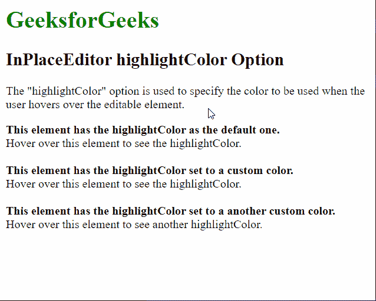

# script . aculo . us in place editor highlight color 选项

> 原文:[https://www . geesforgeks . org/script-aculo-us-in placeeditor-highlight color-option/](https://www.geeksforgeeks.org/script-aculo-us-inplaceeditor-highlightcolor-option/)

script.aculo.us 库是一个跨浏览器库，旨在改进网站的用户界面。Ajax。InPlaceEditor 用于使元素可编辑，从而允许用户编辑页面上的内容并将更改提交给服务器。

位置编辑器中的**选项用于指定用户悬停在可编辑元素上时使用的颜色。颜色必须用六个十六进制数字指定。默认颜色是黄色。**

****语法:****

```
{ highlightColor : color }
```

****参数:**该选项具有如上所述的单一值，如下所述:**

*   ****颜色:**这是一个字符串，指定当用户悬停在可编辑元素上时要使用的颜色。默认颜色为黄色。**

**以下示例说明了该选项的使用。**

****示例:****

**需要下面的脚本来模拟将数据保存到服务器。**

## **服务器端编程语言（Professional Hypertext Preprocessor 的缩写）**

```
<?php
  if( isset($_REQUEST["value"]) ) {
    $str = $_REQUEST["value"];
    echo $str;
  }
?>
```

**下面的脚本通过示例演示了这一点:**

## **超文本标记语言**

```
<!DOCTYPE html>
<html>

<head>
    <script type="text/javascript" 
        src="prototype.js">
    </script>

    <script type="text/javascript" 
        src="scriptaculous.js?load = controls">
    </script>

    <script type="text/javascript">
        window.onload = function () {

            // Default InplaceEditor with no
            // options
            new Ajax.InPlaceEditor(
                'editableElement',
                'http://localhost/tmpscripts/inplace.php',
            );

            // InPlaceEditor with a custom color
            // assigned
            new Ajax.InPlaceEditor(
                'editableElement2',
                'http://localhost/tmpscripts/inplace.php',
                {

                    // Specify the color to
                    // be used to highlight the 
                    // element
                    highlightColor: "#00FF00"
                }
            );

            // InPlaceEditor with a custom color
            // assigned
            new Ajax.InPlaceEditor(
                'editableElement3',
                'http://localhost/tmpscripts/inplace.php',
                {

                    // Specify the color to
                    // be used to highlight the 
                    // element
                    highlightColor: "#FF00FF"
                }
            );
        }
    </script>
</head>

<body>
    <h1 style="color: green">
        GeeksforGeeks
    </h1>

    <h2>InPlaceEditor highlightColor Option</h2>

    <p>
        The "highlightColor" option is used to
        specify the color to be used when the
        user hovers over the editable element.
    </p>

    <b>
        This element has the highlightColor
        as the default one.
    </b>

    <div id="editableElement">
        Hover over this element to 
        see the highlightColor.
    </div>
    <br>

    <b>
        This element has the highlightColor 
        set to a custom color.
    </b>

    <div id="editableElement2">
        Hover over this element to 
        see the highlightColor.
    </div>
    <br>

    <b>
        This element has the highlightColor 
        set to a another custom color.
    </b>
    <div id="editableElement3">
        Hover over this element to see 
        another highlightColor.
    </div>
</body>

</html>
```

****输出:****

****