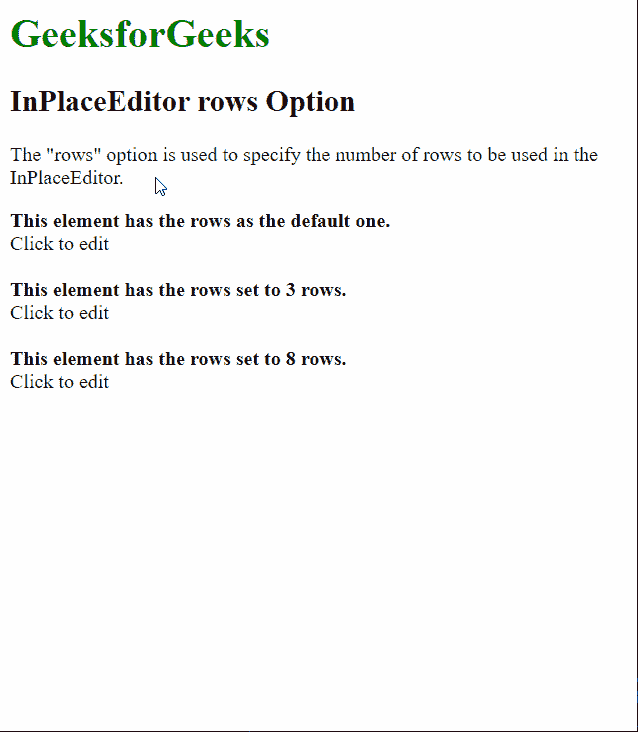

# script . aculo . us in placeeditor 行选项

> 原文:[https://www . geesforgeks . org/script-aculo-us-in placeeditor-rows-option/](https://www.geeksforgeeks.org/script-aculo-us-inplaceeditor-rows-option/)

script.aculo.us 库是一个跨浏览器库，旨在改进网站的用户界面。Ajax。InPlaceEditor 用于使元素可编辑，从而允许用户编辑页面上的内容并将更改提交给服务器。

位置编辑器中的 **行数** 选项用于指定位置编辑器中显示的行数。任何超过“1”的值都会导致多行文本区域作为输入区域。

**语法:**

```
{ rows: value }
```

**参数:**该选项具有如上所述的单一值，如下所述:

*   **值:** 这是一个数字，用于指定要在编辑器中显示的行数。

以下示例说明了该选项的使用。

**示例:**需要下面的脚本来模拟将数据保存到服务器。

## 服务器端编程语言（Professional Hypertext Preprocessor 的缩写）

```
<?php
  if( isset($_REQUEST["value"]) ) {
    $str = $_REQUEST["value"];
    echo $str;
  }
?>
```

下面的脚本通过示例演示了这一点:

## 超文本标记语言

```
<!DOCTYPE html>
<html>

<head>
    <script type="text/javascript" 
        src="prototype.js">
    </script>

    <script type="text/javascript" 
        src="scriptaculous.js?load = controls">
    </script>

    <script type="text/javascript">
        window.onload = function () {

            // Default InplaceEditor with no
            // options
            new Ajax.InPlaceEditor(
                'editableElement',
                'http://localhost/tmpscripts/inplace.php',
            );

            // InplaceEditor with the rows
            // option changed to a custom value
            new Ajax.InPlaceEditor(
                'editableElement2',
                'http://localhost/tmpscripts/inplace.php',
                {

                    // Specify the number of rows
                    // to be used in the InplaceEditor
                    rows: 3
                }
            );

            // InplaceEditor with the rows
            // option changed to a custom value
            new Ajax.InPlaceEditor(
                'editableElement3',
                'http://localhost/tmpscripts/inplace.php',
                {

                    // Specify the number of rows
                    // to be used in the InplaceEditor
                    rows: 8
                }
            );
        }
    </script>
</head>

<body>
    <h1 style="color: green">
        GeeksforGeeks
    </h1>

    <h2>InPlaceEditor rows Option</h2>

    <p>
        The "rows" option is used to specify
        the number of rows to be used in the
        InPlaceEditor.
    </p>

    <b>
        This element has the rows as the
        default one.
    </b>

    <div id="editableElement">Click to edit</div>
    <br>

    <b>This element has the rows set to 3 rows.</b>

    <div id="editableElement2">Click to edit</div>
    <br>

    <b>This element has the rows set to 8 rows.</b>
    <div id="editableElement3">Click to edit</div>
</body>

</html>
```

**输出:**

