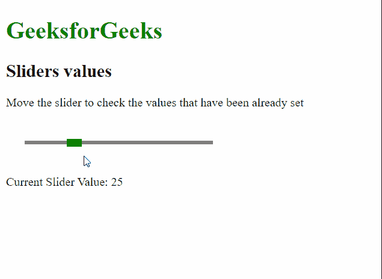
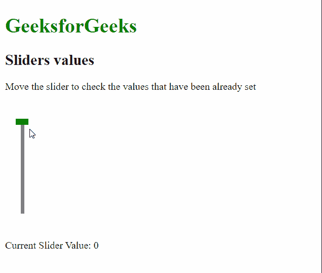

# 脚本. aculo.us 滑块值选项

> 原文:[https://www . geesforgeks . org/script-aculo-us-sliders-values-option/](https://www.geeksforgeeks.org/script-aculo-us-sliders-values-option/)

script.aculo.us 库是一个跨浏览器库，旨在改进网站的用户界面。滑块控件是允许用户输入值的细轨迹。这是通过定义一个值的范围来完成的，用户可以通过将手柄拖动到适当的值来选择该范围。

**滑块值**选项用于定义滑块允许选择的一组值。这可用于限制选项的数量，并精确指定可用的合法值。这组值作为整数数组传递。

**语法:**

```
{ values: [ a, b, c... ] }
```

**值:**

*   **数组:**这是一个指定滑块允许选择的值的数组。

**例 1:**

```
<!DOCTYPE html>
<html>

<head>
  <!-- Include the required scripts -->
  <script type="text/javascript" 
          src="prototype.js">
  </script>
  <script type="text/javascript" 
          src="scriptaculous.js?load = slider">
  </script>

  <!-- Style the Sliders so that they
  are properly visible -->
  <style type="text/css">
    .track {
      width: 250px;
      background-color: gray;
      height: 5px;
      position: relative;
    }

    .track .handle {
      width: 20px;
      height: 10px;
      background-color: green;
      cursor: move;
      position: absolute;
      top: -2px;
    }

    .pad {
      padding: 25px;
    }
  </style>
</head>

<body>
  <p>
  <h1 style="color: green;">
    GeeksforGeeks
  </h1>
  <h2>Sliders values</h2>
  <p>
    Move the slider to check the values
    that have been already set
  </p>

  <div class="pad">
    <div id="track-hor" class="track">
      <div id="handle-hor" class="handle">
      </div>
    </div>
  </div>
  <p>Current Slider Value: 
    <span id="out">0</span>
  </p>

  <script type="text/javascript">

    new Control.Slider('handle-hor',
                       'track-hor', {
      range: $R(1, 100),

      // Define the values that can 
      // be set by the slider
      values: [25, 50, 75, 90],

      onSlide: function (val) {
        document.querySelector("#out")
                .textContent = val;
      }
    });
  </script>
</body>

</html>
```

**输出:**



**例 2:**

```
<!DOCTYPE html>
<html>
<head>
  <!-- Include the required scripts -->
  <script type="text/javascript" 
          src="prototype.js">
  </script>
  <script type="text/javascript" 
          src="scriptaculous.js?load = slider">
  </script>

  <!-- Style the Sliders so that
  they are properly visible -->
  <style type="text/css">
    .track {
      width: 5px;
      background-color: gray;
      height: 150px;
      position: relative;
    }

    .track .handle {
      width: 20px;
      height: 10px;
      background-color: green;
      cursor: move;
      position: absolute;
      left: -8px;
    }

    .pad {
      padding: 25px;
    }
  </style>
</head>
<body>
  <p>
  <h1 style="color: green;">
    GeeksforGeeks
  </h1>
  <h2>Sliders values</h2>
  <p>Move the slider to check the values
    that have been already set</p>

  <div class="pad">
    <div id="track-vert" class="track">
      <div id="handle-vert" class="handle"></div>
    </div>
  </div>
  <p>Current Slider Value: 
    <span id="out">0</span>
  </p>

  <script type="text/javascript">

    new Control.Slider('handle-vert',
                       'track-vert', {
      range: $R(1, 100),
      axis: 'vertical',

      // Define the values that can be
      // set by the slider
      values: [1, 5, 10, 50, 100],

      onSlide: function (val) {
        document.querySelector("#out")
                .textContent = val;
      }
    });
  </script>
</body>
</html>
```

**输出:**

