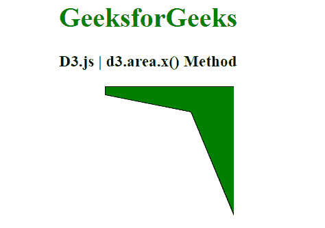
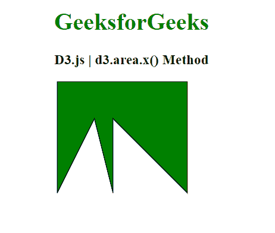

# D3.js area.x()方法

> 原文:[https://www.geeksforgeeks.org/d3-js-area-x-method/](https://www.geeksforgeeks.org/d3-js-area-x-method/)

**d3.area.x()方法**用于将 x 访问器设置为传递给它的参数，该参数可以是数字或返回数字的函数。

**语法:**

```html
d3.area.x(x_point)
```

**参数:**该函数接受一个参数，如上所述，如下所述。

*   **x_point:** 这个参数是一个代表一个点的数字或者是一个返回数字的函数。

**返回值:**此方法不返回值。

**例 1:**

```html
<!DOCTYPE html>
<html>
<head>
    <meta charset="utf-8">

    <script src=
"https://cdnjs.cloudflare.com/ajax/libs/d3/4.2.2/d3.min.js">
    </script>
</head>

<body>
    <h1 style="text-align: center; color: green;">
        GeeksforGeeks
    </h1>

    <h3 style="text-align: center;">
        D3.js | d3.area.x() Method
    </h3>

    <center>
        <svg id="gfg" width="200" height="200">
        </svg>
    </center>

    <script>
        var data = [
          {x: 50, y: 10},
          {x: 150, y: 30},
          {x: 200, y: 150},
          {x: 250, y: 10},
          {x: 300, y: 150},
          {x: 350, y: 50},
          {x: 400, y: 190}];

        var xScale =
 d3.scaleLinear().domain([0, 8]).range([25, 200]);
        var yScale = 
d3.scaleLinear().domain([0, 20]).range([200, 25]);

        var Gen = d3.area()
          // Using area.x() method
          .x((p) => p.x)
          .y0((p) => 0)
          .y1((p) => p.y);

        d3.select("#gfg")
          .append("path")
          .attr("d", Gen(data))
          .attr("fill", "green")
          .attr("stroke", "black");
    </script>
</body>

</html>
```

**输出:**



**例 2:**

```html
<!DOCTYPE html>
<html>
<head>
    <meta charset="utf-8">

    <script src=
"https://cdnjs.cloudflare.com/ajax/libs/d3/4.2.2/d3.min.js">
    </script>
</head>
<body>
    <h1 style="text-align: center; color: green;">
        GeeksforGeeks
    </h1>

    <h3 style="text-align: center;">
        D3.js | d3.area.x() Method
    </h3>

    <center>
        <svg id="gfg" width="250" height="200">
         </svg>
    </center>

    <script>
        var points = [
          {xpoint: 25,  ypoint: 150},
          {xpoint: 75,  ypoint: 50},
          {xpoint: 100, ypoint: 150},
          {xpoint: 100, ypoint: 50},
          {xpoint: 200, ypoint: 150}];

        var Gen = d3.area()
           // Using area.x() method
          .x((p) => p.xpoint)
          .y0((p) => 0)
          .y1((p) => p.ypoint);

        d3.select("#gfg")
          .append("path")
          .attr("d", Gen(points))
          .attr("fill", "green")
          .attr("stroke", "black");

    </script>
</body>

</html>
```

**输出:**

