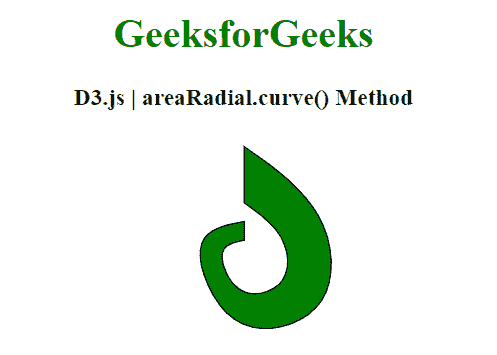
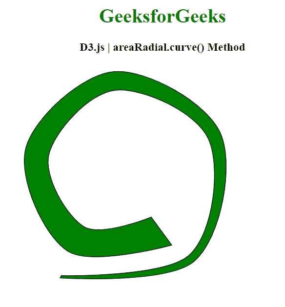

# D3.js 面积径向曲线()方法

> 原文:[https://www . geesforgeks . org/D3-js-area radial-curve-method/](https://www.geeksforgeeks.org/d3-js-arearadial-curve-method/)

使用 **D3.js** 中的 **面积径向曲线()**方法来指定给和面积径向曲线的类型。D3.js 提供了几个曲线工厂，可以用来获取不同类型的曲线。

**语法:**

```
areaRadial.curve( curve_factory )

```

**参数:** 该方法接受如上所述的单个参数，描述如下:

*   **曲线 _ 工厂:**这是用于面积径向的型曲线。这是一个可选参数。

**返回值:**此方法不返回值。

下面给出了 D3.js 中**面积径向曲线()**方法的几个例子:

**例 1:**

## 超文本标记语言

```
<!DOCTYPE html>
<html>
<head>
  <script src=
"https://d3js.org/d3.v5.min.js">
  </script>
</head>
<body>
  <h1 style="text-align: center;
             color: green;">
    GeeksforGeeks
  </h1>
  <h3 style="text-align: center;">
    D3.js | areaRadial.curve() Method
  </h3>
  <center>
    <svg id="gfg" width="200" height="200">
      <g transform="translate(100,100)"></g>
    </svg>
  </center>
  <script>
    var points = [
      { x: 0, y: 0 },
      { x: 2, y: 3 },
      { x: 4, y: 1 },
      { x: 6, y: 8 },
      { x: 8, y: 17 },
      { x: 10, y: 15 },
      { x: 12, y: 20 }];

    var xScale = d3.scaleLinear()
        .domain([0, 6])
        .range([0, 2 * Math.PI]);
    var yScale = d3.scaleLinear()
        .domain([0, 20])
        .range([90, 30]);

    var Gen = d3.areaRadial()
      .angle(d => xScale(d.x / 2))
      .innerRadius(d => yScale(d.y) / 2)
      .outerRadius(d => yScale(d.y))

      // Set the given
      // curve factory
      .curve(d3.curveBasis);

    d3.select("#gfg")
      .select("g")
      .append("path")
      .attr("d", Gen(points))
      .attr("fill", "green")
      .attr("stroke", "black");
  </script>
</body>
</html>
```

**输出:**



**例 2:**

## 超文本标记语言

```
<!DOCTYPE html>
<html>
<head> 
  <script src=
"https://d3js.org/d3.v5.min.js">
  </script>
</head>
<body>
  <h1 style="text-align: center;
             color: green;">
    GeeksforGeeks
  </h1>

  <h3 style="text-align: center;">
    D3.js | areaRadial.curve() Method
  </h3>
  <center>
    <svg id="gfg" width="500" height="500">
      <g transform="translate(180,180)"></g>
    </svg>
  </center>
  <script>
    var data = [
      { x: 10, y: 1 },
      { x: 15, y: 3 },
      { x: 20, y: 5 },
      { x: 25, y: 7 },
      { x: 30, y: 9 },
      { x: 35, y: 11 },
      { x: 40, y: 13 }];

    var xScale = d3.scaleLinear()
        .domain([0, 8])
        .range([25, 200]);
    var yScale = d3.scaleLinear()
        .domain([0, 20])
        .range([200, 25]);

    var Gen = d3.areaRadial()
      .angle(d => xScale(d.x / 3))
      .innerRadius(d => yScale(d.y / 2))
      .outerRadius(d => yScale(d.y))

      // Set the given
      // curve factory
      .curve(d3.curveCardinal);

    d3.select("#gfg")
      .select("g")
      .append("path")
      .attr("d", Gen(data))
      .attr("fill", "green")
      .attr("stroke", "black");
  </script>
</body>
</html>
```

**输出:**

