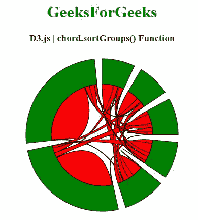

# D3.js 和弦. sortGroups()功能

> 原文:[https://www . geesforgeks . org/D3-js-chord-sort groups-function/](https://www.geeksforgeeks.org/d3-js-chord-sortgroups-function/)

**D3.js** 中的 **chord.sortGroups()** 功能用于将组比较器设置为指定功能或 null，并返回该和弦布局。

**语法:**

```
chord.sortGroups( [compare] )
```

**参数:**该函数接受一个参数，如上所述，如下所述

*   **比较:**该参数是设置组比较器的功能。

**返回值:**该函数返回和弦布局。

下面的程序说明了 D3.js 中的 **chord.sortGroups()** 功能:

**例 1:**

## 超文本标记语言

```
<!DOCTYPE html>
<html>

<head>
    <script src="https://d3js.org/d3.v4.min.js">
    </script>
</head>

<body>
    <center>
        <h1 style="color:green;">GeeksForGeeks</h1>

        <h3>D3.js | chord.sortGroups() Function</h3>
        <div id="GFG"></div>

        <script>
            // Create the svg area
            var svg = d3.select("#GFG")
                .append("svg")
                .attr("width", 320)
                .attr("height", 320)
                .append("g")
                .attr("transform", "translate(160,160)")

            // Create input data
            var data = [[10, 161, 80, 80, 12, 34, 53],
            [13, 990, 9, 69, 76, 35, 4],
            [175, 71, 16, 68, 0, 0, 3],
            [51, 148, 60, 71, 34, 5, 1],
            [13, 990, 9, 69, 76, 35, 4],
            [175, 71, 16, 68, 0, 0, 3],
            [51, 148, 60, 71, 34, 5, 1]];

            // Give this matrix to d3.chord()
            var chords = d3.chord()
                .padAngle(0.1)

                // Use of chord.sortGroups() Function
                .sortGroups(d3.ascending)
                (data)

            svg.datum(chords)
                .append("g")
                .selectAll("g")
                .data(function (d) { return d.groups; })
                .enter()
                .append("g")
                .append("path")
                .style("fill", "green")
                .style("stroke", "black")
                .attr("d", d3.arc()
                    .innerRadius(100)
                    .outerRadius(150)
                )

            svg.datum(chords)
                .append("g")
                .selectAll("path")
                .data(function (d) { return d; })
                .enter()
                .append("path")
                .attr("d", d3.ribbon()
                    .radius(100)
                )
                .style("fill", "red")
                .style("stroke", "black");
        </script>
    </center>
</body>

</html>
```

**输出:**



**例 2:**

## 超文本标记语言

```
<!DOCTYPE html>
<html>

<head>
    <script src="https://d3js.org/d3.v4.min.js">
    </script>
    <script src=
        "https://d3js.org/d3-color.v1.min.js">
    </script>
    <script src=
    "https://d3js.org/d3-interpolate.v1.min.js">
    </script>
    <script src=
    "https://d3js.org/d3-scale-chromatic.v1.min.js">
    </script>
</head>

<body>
    <center>
        <h1 style="color:green;">GeeksForGeeks</h1>

        <h3>D3.js | chord.sortGroups() Function</h3>
        <div id="GFG"></div>

        <script>

            // Create the svg area
            var svg = d3.select("#GFG")
                .append("svg")
                .attr("width", 340)
                .attr("height", 340)
                .append("g")
                .attr("transform", "translate(170,170)")

            // Create input data
            var data = [[0, 71, 89, 68, 71, 89, 68],
            [11, 0, 60, 71, 9, 9, 0],
            [10, 145, 0, 85, 145, 0, 85],
            [13, 9, 9, 0, 0, 60, 71],
            [13, 9, 9, 0, 0, 60, 71],
            [10, 145, 0, 85, 145, 0, 85],
            [0, 71, 89, 68, 71, 89, 68]];

            // 4 groups, so create a vector
            // of 4 colors
            var colors = [d3.schemeSet1[0], 
                d3.schemeCategory10[1],
                d3.schemeCategory10[2], 
                d3.schemeCategory10[3],
                d3.schemeCategory10[4], 
                d3.schemeCategory10[5],
                d3.schemeCategory10[6]];

            var colors_1 = [d3.schemeSet1[0], 
                d3.schemeSet1[1],
                d3.schemeSet1[2], 
                d3.schemeSet1[3],
                d3.schemeSet1[4], 
                d3.schemeSet1[5],
                d3.schemeSet1[6]];

            // Give this matrix to d3.chord()
            var chords = d3.chord()
                .padAngle(0.07)

                // Use of chord.sortGroups() Function
                .sortGroups(d3.descending)
                (data)

            svg.datum(chords)
                .append("g")
                .selectAll("g")
                .data(function (d) { return d.groups; })
                .enter()
                .append("g")
                .append("path")
                .style("fill", function (d, i) {
                    return colors[i]
                })
                .style("stroke", "black")
                .attr("d", d3.arc()
                    .innerRadius(150)
                    .outerRadius(160)
                )

            svg.datum(chords)
                .append("g")
                .selectAll("path")
                .data(function (d) { return d; })
                .enter()
                .append("path")
                .attr("d", d3.ribbon()
                    .radius(150)
                )
                .style("fill", function (d, i) {
                    return colors_1[i]
                })
                .style("stroke", "black");
        </script>
    </center>
</body>

</html>
```

**输出:**

