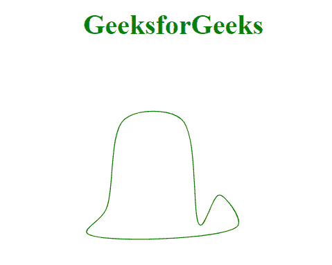
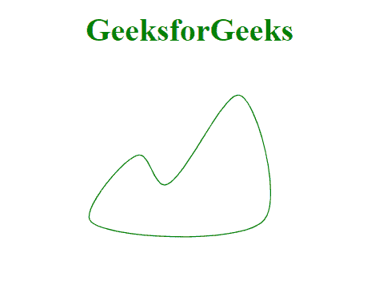

# D3 . js curvecatamullrommclosed()方法

> 原文:[https://www . geeksforgeeks . org/D3-js-curvecatamullrommclosed-method/](https://www.geeksforgeeks.org/d3-js-curvecatmullromclosed-method/)

内插器产生一个三次曲线样条。该曲线也基于这些三次曲线样条。 这是一个开放变量，它将数据集中的第一个和最后一个点与一条曲线结合在一起。

**语法:**

```
d3.curveCatmullRomClosed()
```

**参数:**此方法不接受任何参数。

**返回值:**此方法不返回值。

**例 1:**

## 超文本标记语言

```
<!DOCTYPE html>
<html>

<head>
    <meta charset="utf-8">
    <script src=
"https://cdnjs.cloudflare.com/ajax/libs/d3/4.2.2/d3.min.js">
    </script>
</head>

<body>
    <h1 style="text-align:center; color:green;">
        GeeksforGeeks
    </h1>
    <center>
        <svg id="gfg" width="250" height="250"></svg>
    </center>

    <script>
        var data = [
            { x: 0, y: 0 },
            { x: 1, y: 3 },
            { x: 2, y: 15 },
            { x: 5, y: 15 },
            { x: 6, y: 1 },
            { x: 7, y: 5 },
            { x: 8, y: 1 }];

        var xScale = d3.scaleLinear()
            .domain([0, 8]).range([25, 200]);
        var yScale = d3.scaleLinear()
            .domain([0, 20]).range([200, 25]);

        var line = d3.line()
            .x((d) => xScale(d.x))
            .y((d) => yScale(d.y))
            .curve(d3.curveCatmullRomClosed);

        d3.select("#gfg")
            .append("path")
            .attr("d", line(data))
            .attr("fill", "none")
            .attr("stroke", "green");
    </script>
</body>

</html>
```

**输出:**



**例 2:**

## 超文本标记语言

```
<!DOCTYPE html>
<html>

<head>
    <meta charset="utf-8">
    <script src=
"https://cdnjs.cloudflare.com/ajax/libs/d3/4.2.2/d3.min.js">
    </script>
</head>

<body>
    <h1 style="text-align:center; color:green;">
        GeeksforGeeks
    </h1>
    <center>
        <svg id="gfg" width="250" height="200"></svg>
    </center>

    <script>
        var points = [
            { xpoint: 25, ypoint: 150 },
            { xpoint: 75, ypoint: 85 },
            { xpoint: 100, ypoint: 115 },
            { xpoint: 175, ypoint: 25 },
            { xpoint: 200, ypoint: 150 }];

        var Gen = d3.line()
            .x((p) => p.xpoint)
            .y((p) => p.ypoint)
            .curve(d3.curveCatmullRomClosed);

        d3.select("#gfg")
            .append("path")
            .attr("d", Gen(points))
            .attr("fill", "none")
            .attr("stroke", "green");
    </script>
</body>

</html>
```

**输出:**

