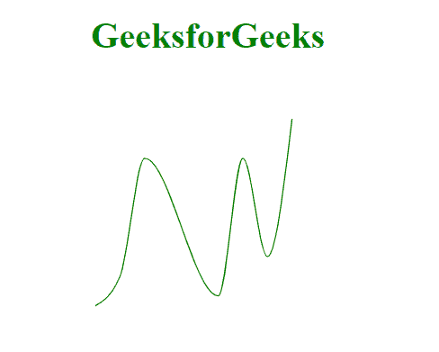
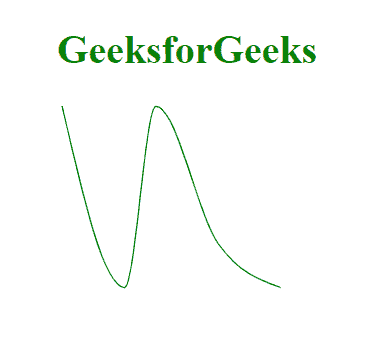

# D3.js curveMonotoneX()方法

> 原文:[https://www.geeksforgeeks.org/d3-js-curvemonotonex-method/](https://www.geeksforgeeks.org/d3-js-curvemonotonex-method/)

D3 . curvemonotonex插值器假设根据 x 坐标对数据进行排序，否则对数据进行相应排序。这种曲线方法产生一个三次样条，假设在 x 中是单调性的，它在 y 中保持单调性

**语法:**

```
d3.curveMonotoneX()

```

**参数:**此方法不接受任何参数。

**返回值:**此方法不返回值。

**例 1:**

```
<!DOCTYPE html>
<html>

<head>
    <meta charset="utf-8">
    <script src=
"https://cdnjs.cloudflare.com/ajax/libs/d3/4.2.2/d3.min.js">
    </script>
</head>

<body>
    <h1 style="text-align:center; color:green;">
        GeeksforGeeks
    </h1>

    <center>
        <svg id="gfg" width="250" height="250"></svg>
    </center>

    <script>
        var data = [
          {x: 0, y: 0},
          {x: 1, y: 3},
          {x: 2, y: 15},
          {x: 5, y: 1},
          {x: 6, y: 15},
          {x: 7, y: 5},
          {x: 8, y: 19}];

        var xScale = d3.scaleLinear()
          .domain([0, 8]).range([25, 200]);
        var yScale = d3.scaleLinear()
          .domain([0, 20]).range([200, 25]);

        var line = d3.line()
          .x((d) => xScale(d.x))
          .y((d) => yScale(d.y))
          .curve(d3.curveMonotoneX);

        d3.select("#gfg")
          .append("path")
          .attr("d", line(data))
          .attr("fill", "none")
          .attr("stroke", "green");
    </script>
</body>
</html>
```

**输出:**



**示例 2:** 按 x 轴对未排序的点进行排序，然后渲染曲线。

```
<!DOCTYPE html>
<html>

<head>
    <meta charset="utf-8">
    <script src=
"https://cdnjs.cloudflare.com/ajax/libs/d3/4.2.2/d3.min.js">
    </script>
</head>

<body>
    <h1 style="text-align:center; color:green;">
        GeeksforGeeks
    </h1>

    <center>
        <svg id="gfg" width="250" height="200"></svg>
    </center>

    <script>
        var points = [
          {xpoint: 75,  ypoint: 150},
          {xpoint: 25,  ypoint: 5},
          {xpoint: 150, ypoint: 115},
          {xpoint: 100, ypoint: 5},
          {xpoint: 200, ypoint: 150}];

        // Sorting the points by x axis
        points.sort((a, b) => a.xpoint - b.xpoint);

        var Gen = d3.line()
          .x((p) => p.xpoint)
          .y((p) => p.ypoint)
          .curve(d3.curveMonotoneX);

        d3.select("#gfg")
          .append("path")
          .attr("d", Gen(points))
          .attr("fill", "none")
          .attr("stroke", "green");

    </script>
</body>
</html>
```

**输出:**

