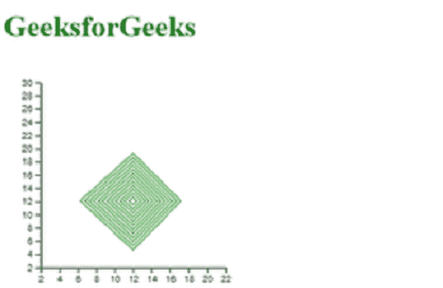
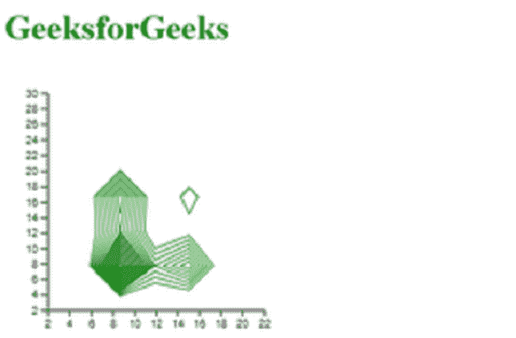

# D3.js 密度. cellSize()函数

> 原文:[https://www . geesforgeks . org/D3-js-density-cell size-function/](https://www.geeksforgeeks.org/d3-js-density-cellsize-function/)

**密度细胞大小()**函数用于设置密度估计器函数的细胞大小。如果给定单元格大小，该函数设置单个单元格的大小。如果单元格的大小没有给出，那么它返回当前单元格的大小，等于 4。请注意，单元格越小，轮廓多边形中呈现的细节就越多。

**语法:**

```
d3.contourDensity.cellSize([cellSize]);

```

**参数:**该函数取一个参数，如上所述，如下所述。

*   **单元格大小:**取一个定义单元格大小的数字。

**返回值:**这个函数不返回任何东西。

**注意:**请先创建一个文件“data.csv”，然后再进行代码。

下面给出了几个密度细胞大小函数的例子。

**例 1:**

## 超文本标记语言

```
<!DOCTYPE html> 
<html lang="en"> 

<head> 
    <meta charset="UTF-8"> 
    <meta name="viewport" content=" 
        width=device-width, initial-scale=1.0"> 

    <script type="text/javascript"
        src="https://d3js.org/d3.v4.min.js"> 
    </script> 
    <script src="https://d3js.org/d3-contour.v1.min.js">
    </script>
</head> 

<body> 
    <h1 style="color:green">GeeksforGeeks</h1>

    <script> 

        // append the svg object to the body.
        var svg = d3.select("body")
        .append("svg")
            .attr("width", 530)
            .attr("height", 480)
        .append("g")
            .attr("transform",
                "translate(" + 40 + ", " + -80 + ")");

        // read data
        d3.csv("./data.csv", function(data) {

        var y = d3.scaleLinear()
            .domain([2, 30])
            .range([ 300, 100 ]);

        var x = d3.scaleLinear()
            .domain([2, 22])
            .range([ 0, 200]);

        svg.append("g")
        .call(d3.axisLeft(y));

        svg.append("g")
            .attr("transform", "translate(0, " + 300 + ")")
            .call(d3.axisBottom(x));

        var density= d3.contourDensity()
            .y(function(d) { return y(d.y); })
            .x(function(d) { return x(d.x); })
            // Use of cellSize() Function
            .cellSize(100)
            (data)

        svg.selectAll("path")
            .data(density)
            .enter()
            .append("path")
            .attr("d", d3.geoPath())
            .attr("fill", "none")
            .attr("stroke", "green")
        });

        // Data for csv file
        // x, y, group
        // 9.45, 14.14, H
        // 9.1, 14.14, H
        // 9.9, 9.9, H
        // 9.6, 14.5, H
        // 9.1, 9.7, H
        // 14.7, 9.5, H
        // 7.9, 9.6, H
        // 14.7, 9.7, H
        // 9.45, 14.14, H
        // 12.1, 9.14, H
        // 7.5, 9, H
        // 14.5, 14.5, H
        // 9.45, 9.7, H
        // 14.45, 9.6, H
        // 9.5, 7.6, H
        // 9, 9.45, H
        // 14.7, 12, H
        // 9.7, 9.7, H
        // 9.6, 9, H
        // 12, 9, H
        // 9.45, 14.5, H
        // 9.9, 14.6, H
        // 12.7, 9.9, H
        // 9, 12.14, H
        // 9, 14.9, H
        // 9.5, 9.7, H
        // 9.7, 14.7, H
        // 9.9, 14.5, H
        // 14, 14.5, H
        // 7.9, 9, H
        // 9.9, 9.45, H
        // 9, 14.14, H
        // 14.7, 9.7, H
        // 14.5, 9.9, H
    </script> 
</body>
</html> 
```

**输出:**



**例 2:**

## 超文本标记语言

```
<!DOCTYPE html> 
<html lang="en"> 

<head> 
    <meta charset="UTF-8"> 
    <meta name="viewport" content=" 
        width=device-width, initial-scale=1.0"> 

    <script type="text/javascript"
        src="https://d3js.org/d3.v4.min.js"> 
    </script> 
    <script src="https://d3js.org/d3-contour.v1.min.js">
    </script>
</head> 

<body> 
    <h1 style="color:green">GeeksforGeeks</h1>

    <script>
        // append the svg object to the body.
        var svg = d3.select("body")
        .append("svg")
            .attr("width", 530)
            .attr("height", 480)
        .append("g")
            .attr("transform",
                "translate(" + 40 + ", " + -80 + ")");

        // read data
        d3.csv("./data.csv", function(data) {

        var y = d3.scaleLinear()
            .domain([2, 30])
            .range([ 300, 100 ]);

        var x = d3.scaleLinear()
            .domain([2, 22])
            .range([ 0, 200]);

        svg.append("g")
        .call(d3.axisLeft(y));

        svg.append("g")
            .attr("transform", "translate(0, " + 300 + ")")
            .call(d3.axisBottom(x));

        var density= d3.contourDensity()
            .y(function(d) { return y(d.y); })
            .x(function(d) { return x(d.x); })
            .bandwidth(15)
            // Use of cellSize() Function
            .cellSize(50)
            (data)

        svg.selectAll("path")
            .data(density)
            .enter()
            .append("path")
            .attr("d", d3.geoPath())
            .attr("fill", "none")
            .attr("stroke", "green")
        });

        // Data for csv file
        // x, y, group
        // 9.45, 14.14, H
        // 9.1, 14.14, H
        // 9.9, 9.9, H
        // 9.6, 14.5, H
        // 9.1, 9.7, H
        // 14.7, 9.5, H
        // 7.9, 9.6, H
        // 14.7, 9.7, H
        // 9.45, 14.14, H
        // 12.1, 9.14, H
        // 7.5, 9, H
        // 14.5, 14.5, H
        // 9.45, 9.7, H
        // 14.45, 9.6, H
        // 9.5, 7.6, H
        // 9, 9.45, H
        // 14.7, 12, H
        // 9.7, 9.7, H
        // 9.6, 9, H
        // 12, 9, H
        // 9.45, 14.5, H
        // 9.9, 14.6, H
        // 12.7, 9.9, H
        // 9, 12.14, H
        // 9, 14.9, H
        // 9.5, 9.7, H
        // 9.7, 14.7, H
        // 9.9, 14.5, H
        // 14, 14.5, H
        // 7.9, 9, H
        // 9.9, 9.45, H
        // 9, 14.14, H
        // 14.7, 9.7, H
        // 14.5, 9.9, H
    </script> 
</body> 

</html> 
```

**输出:**

