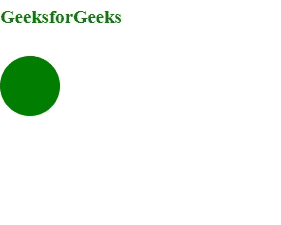

# D3 . js easellinear()函数

> 原文:[https://www.geeksforgeeks.org/d3-js-easelinear-function/](https://www.geeksforgeeks.org/d3-js-easelinear-function/)

d3.js 中的**D3 . easellinear()**函数用于线性缓和到特定元素的过渡效果。这个线性宽松函数返回一个恒等式。

**语法:**

```
d3.easeLinear

```

**参数:**此功能不接受任何参数。

**返回值:**该函数不返回值。

**进场:**

D3.js 转换函数将用于对特定元素应用不同的缓和效果。首先，创建一个 SVG 元素并将其附加到 HTML 页面的主体，然后创建一个圆并将其附加到 SVG。设置圆的一些属性，使其具有良好的颜色和大小，并应用 **d3.transition** 功能，然后应用 **ease()** 功能，并使用**D3 . easellinear**作为参数来实现 ease 功能。

下面是上面给出的函数的几个例子。

**例 1:**

## 超文本标记语言

```
<!DOCTYPE html>
<html lang="en">

<head>
    <meta charset="UTF-8">
    <meta name="viewport" 
        content="width=device-width, 
                initial-scale=1.0">

    <script src="https://d3js.org/d3.v4.min.js"></script>  
</head>

<body>
    <h3 style="color:green">GeeksforGeeks</h3>
    <svg width="500px" height="500px">
    </svg>

    <script>
        var svg = d3.select("svg");

        svg.append("circle")
            .attr("r", 30)
            .attr("cy",40)
            .attr("cx",30)
            .attr("fill", "green")
            .transition()
            // Use of easeLinear
            .ease(d3.easeLinear)
            .duration(2000)
            .attr("cy",40)
            .attr("cx",200);
    </script>
</body>

</html>
```

**输出:**



**例 2:**

## 超文本标记语言

```
<!DOCTYPE html>
<html lang="en">

<head>
    <meta charset="UTF-8">
    <meta name="viewport" 
        content="width=device-width, 
                initial-scale=1.0">

    <script src="https://d3js.org/d3.v4.min.js"></script>  
</head>

<body>
    <h1 style="color:green">GeeksforGeeks</h1>

    <svg width="500px" height="500px">
    </svg>

    <script>
        var svg = d3.select("svg")
                    .attr("transform","translate(0,-50)");

        svg.append("rect")
            .attr("x", 10)
            .attr("y",50)
            .attr("width",150)
            .attr("height",50)
            .attr("fill", "green")
            .transition()
            // Ease linear
            .ease(d3.easeLinear)
            .attr("x", 100)
            .attr("y",100)
            .attr("width",100)
            .attr("height",10)
            .duration(2000);
    </script>
</body>

</html>
```

**输出:**

