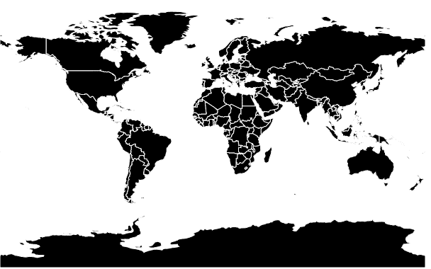
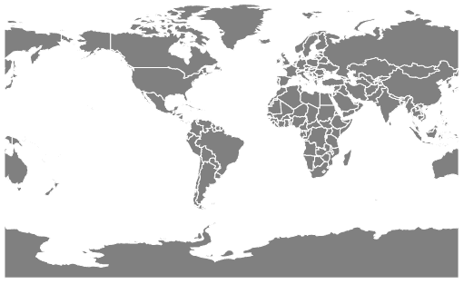

# D3 . js geoCylindricalStereographic()功能

> 原文:[https://www . geeksforgeeks . org/D3-js-geocylindricalstereographic-function/](https://www.geeksforgeeks.org/d3-js-geocylindricalstereographic-function/)

D3.js 是一个 JavaScript 库，用于在 web 浏览器中产生动态的、交互式的数据可视化。它利用了可伸缩矢量图形、HTML5 和级联样式表标准。
利用 d3.js 中的 CylindricalEqualArea()函数绘制圆柱立体投影。

**语法:**

```
d3.geoCylindricalStereographic()
```

**参数:**此方法不接受任何参数。

**返回值:**该方法根据给定的 json 数据创建圆柱立体投影。

**示例 1:** 以下示例绘制世界的圆柱立体投影，中心位于(0，0)且旋转 0°。

```
<!DOCTYPE html>
<html lang="en">

<head>
    <meta charset="UTF-8" />
    <meta name="viewport" content="width=device-width, 
                initial-scale=1.0" />
</head>

<body>
    <div style="width:700px; height:500px;">
        <center>
            <h3 style="color:black">
            </h3>
        </center>
        <svg width="600" height="450">
        </svg>
    </div>
    <script src="https://d3js.org/d3.v4.js"></script>
    <script src=
    "https://d3js.org/d3-geo-projection.v2.min.js">
    </script>
    <script>

        var svg = d3.select("svg"),
            width = +svg.attr("width"),
            height = +svg.attr("height");

        // CylindricalStereographic projection
        // Center(0, 0) with 0 rotation
        var gfg = d3.geoCylindricalStereographic()
            .scale(width / 2.0 / Math.PI)
            .rotate([0, 0])
            .center([0, 0])
            .translate([width / 2, height / 2])

        // Loading the json data
        // Used json file stored at 
        // https://raw.githubusercontent.com/janasayantan
        // /datageojson/master/world.json
        d3.json("https://raw.githubusercontent.com/"
            + "janasayantan/datageojson/master/world.json",
            function (data) {

                // Drawing the map
                svg.append("g")
                    .selectAll("path")
                    .data(data.features)
                    .enter().append("path")
                    .attr("fill", "Black")
                    .attr("d", d3.geoPath()
                        .projection(gfg)
                    )
                    .style("stroke", "#ffff")
            })
    </script>
</body>

</html>
```

**输出:**



世界的圆柱立体投影，没有旋转，中心在(0，0)

**示例 2** :以下示例在改变中心和旋转后绘制世界的柱面立体投影。

```
<!DOCTYPE html>
<html lang="en">

<head>
    <meta charset="UTF-8" />
    <meta name="viewport" content="width=device-width, 
                initial-scale=1.0" />
</head>

<body>
    <div style="width:700px; height:600px;">
        <center>
            <h3 style="color:black">
            </h3>
        </center>
        <svg width="500" height="450">
        </svg>
    </div>
    <script src="https://d3js.org/d3.v4.js"></script>
    <script src=
    "https://d3js.org/d3-geo-projection.v2.min.js">
    </script>
    <script>

        var svg = d3.select("svg"),
            width = +svg.attr("width"),
            height = +svg.attr("height");

        // CylindricalStereographic  projection
        // Center(0, 20) and 45 degree rotation w.r.t Y axis
        var gfg = d3.geoCylindricalStereographic()
            .scale(width / 2.0 / Math.PI)
            .rotate([45, 0])
            .center([0, 20])
            .translate([width / 2, height / 2])

        // Loading the json data
        // Used json file stored at 
        // https://raw.githubusercontent.com/janasayantan
        // /datageojson/master/world.json
        d3.json("https://raw.githubusercontent.com/"
        + "janasayantan/datageojson/master/world.json",
            function (data) {

                // Draw the map
                svg.append("g")
                    .selectAll("path")
                    .data(data.features)
                    .enter().append("path")
                    .attr("fill", "grey")
                    .attr("d", d3.geoPath()
                        .projection(gfg)
                    )
                    .style("stroke", "#ffff")
    </script>
</body>

</html>
```

**输出:**



圆柱形等面积投影，相对于 Y 轴旋转 45 度，以(0，20)为中心