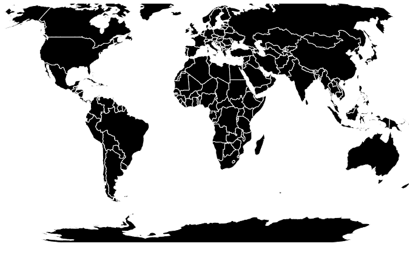
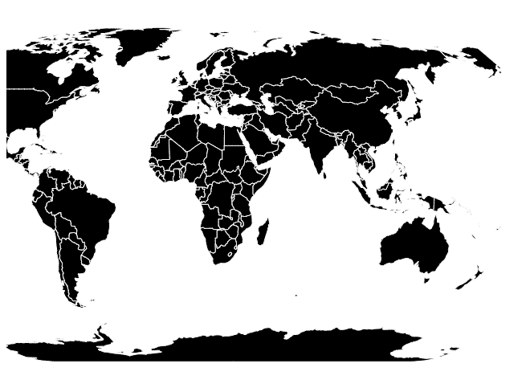

# D3.js geoNaturalEarth()函数

> 原文:[https://www . geesforgeks . org/D3-js-geonatural earth-function/](https://www.geeksforgeeks.org/d3-js-geonaturalearth-function/)

功能 **geoNaturalEarth()** 用于返回 **Natural Earth** 投影。

**语法:**

```
d3.geoNaturalEarth()

```

**参数:**此方法不接受任何参数。

**返回值:**该方法根据给定的 JSON 数据创建并返回 geoNaturalEarth()投影。

**示例 1:** 以下示例创建世界的 geoNaturalEarth()投影，中心位于(0，0)且无旋转。

## 超文本标记语言

```
<!DOCTYPE html> 
<html lang="en"> 

<head> 
    <meta charset="UTF-8" /> 
    <meta name="viewport" content="width=device-width, 
                initial-scale=1.0" /> 

    <script src="https://d3js.org/d3.v4.js"></script> 

    <script src= 
"https://d3js.org/d3-geo-projection.v2.min.js"> 
    </script> 
</head> 

<body> 
    <div style="width:700px; height:600px;"> 
        <svg width="700" height="550"> 
        </svg> 
    </div> 

    <script> 
        var svg = d3.select("svg"), 
            width = +svg.attr("width"), 
            height = +svg.attr("height"); 

        // Natural Earth projection 
        // Center(0,0) and no rotation 
        var gfg = d3.geoNaturalEarth()
            .scale(width / 1.5 / Math.PI) 
            .rotate([0, 0]) 
            .center([0, 0]) 
            .translate([width / 2, height / 3]) 

        // Loading the json data 
        d3.json("https://raw.githubusercontent.com/"
            +"epistler999/GeoLocation/master/world.json", 
            function (data) { 
                // Draw the map 
                svg.append("g") 
                    .selectAll("path") 
                    .data(data.features) 
                    .enter().append("path") 
                    .attr("fill", "black") 
                    .attr("d", d3.geoPath() 
                        .projection(gfg) 
                    ) 
                    .style("stroke", "#ffff") 
            }) 
    </script> 
</body>

</html>
```

**输出:**



**示例 2:** 在下面的示例中，我们将创建世界的 geoNaturalEarth()投影，中心位于(30，0)，并相对于 Y 轴逆时针旋转 30 度。

## 超文本标记语言

```
<!DOCTYPE html> 
<html lang="en"> 

<head> 
    <meta charset="UTF-8" /> 
    <meta name="viewport" content="width=device-width, 
                initial-scale=1.0" /> 
    <script src="https://d3js.org/d3.v4.js"></script> 
    <script src= 
"https://d3js.org/d3-geo-projection.v2.min.js"> 
    </script> 
</head> 

<body> 
    <div style="width:700px; height:600px;"> 
        <svg width="700" height="550"> 
        </svg> 
    </div> 

    <script> 
        var svg = d3.select("svg"), 
            width = +svg.attr("width"), 
            height = +svg.attr("height"); 

        // geoNaturalEarth() projection 
        // Center(30, 0) and 30 degree rotation 
        var gfg = d3.geoNaturalEarth()
            .scale(width / 1.5 / Math.PI) 
            .rotate([-30, 0]) 
            .center([30, 0]) 
            .translate([width / 2, height / 2]) 

        // Loading the json data 
        // Used json file stored at 
        // https://raw.githubusercontent.com/epistler999/ 
        // GeoLocation/master/world.json
        d3.json("https://raw.githubusercontent.com/"
            +"epistler999/GeoLocation/master/world.json", 
            function (data) { 
                // Draw the map 
                svg.append("g") 
                    .selectAll("path") 
                    .data(data.features) 
                    .enter().append("path") 
                    .attr("fill", "black") 
                    .attr("d", d3.geoPath() 
                        .projection(gfg) 
                    ) 
                    .style("stroke", "#ffff") 
            }) 
    </script> 
</body> 

</html> 
```

**输出:**

