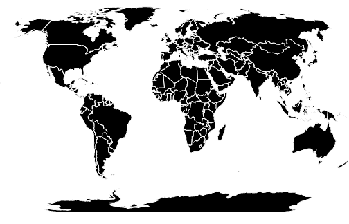
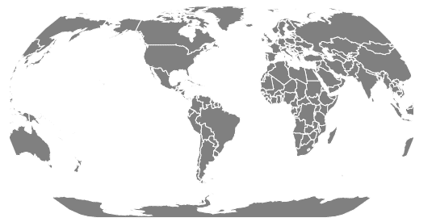

# D3 . js geonatureearth 1()功能

> 原文:[https://www . geesforgeks . org/D3-js-geonatureearth 1-function/](https://www.geeksforgeeks.org/d3-js-geonaturalearth1-function/)

JavaScript **D3.js** 库使用 HTML5、可缩放矢量图形和级联样式表为网页提供交互式数据可视化。 **d3.js** 中的**自然地球 1** ()功能用于绘制**自然地球**投影。

**语法:**

```
d3.geoNaturalEarth1()
```

**参数:**此方法不接受任何参数。

**返回:**该方法根据给定的 JSON 数据创建自然地球投影。

**示例#1:** 以下示例创建世界的自然地球 1 投影，中心位于(0，0)且无旋转。

## 超文本标记语言

```
<!DOCTYPE html>
<html lang="en">

<head>
    <meta charset="UTF-8" />
    <meta name="viewport"
        content="width=device-width,
                initial-scale=1.0"/>

</head>

<body>
    <div style="width:700px; height:500px;">
        <center>

            <h3 style="color:black">

            </h3> 

        </center>

        <svg width="600" height="450">
        </svg>
    </div>
    <script src="https://d3js.org/d3.v4.js"></script>
    <script src=
"https://d3js.org/d3-geo-projection.v2.min.js">
     </script>
    <script>

var svg = d3.select("svg"),
    width = +svg.attr("width"),
    height = +svg.attr("height");

// NaturalEarth1 projection
// Center(0, 0) with 0 rotation
var gfg = d3.geoNaturalEarth1()
    .scale(width / 1.8 / Math.PI)
    .rotate([0, 0])
    .center([0, 0])
    .translate([width / 2, height / 2])

// Loading the json data
/* Used json file stored at https://raw.githubusercontent.com/janasayantan
 /datageojson/master/world.json*/
d3.json(
"https://raw.githubusercontent.com/janasayantan/datageojson/master/world.json",
     function(data){

    // Drawing the map
    svg.append("g")
        .selectAll("path")
        .data(data.features)
        .enter().append("path")
            .attr("fill", "Black")
            .attr("d", d3.geoPath()
            .projection(gfg)
            )
            .style("stroke", "#ffff")
})

</script>
</body>

</html>
```

**输出:**



**示例 2:** 在下面的示例中，我们将创建世界的自然地球 1 投影，中心位于(0，10)并相对于 Y 轴旋转 60 度。

## 超文本标记语言

```
<!DOCTYPE html>
<html lang="en">
    <head>
        <meta charset="UTF-8" />
        <meta
            name="viewport"
            content="width=device-width,
                initial-scale=1.0"
        />
    </head>

    <body>
        <div style="width: 700px; height: 600px;">
            <center>
                <h3 style="color: black;"></h3>
            </center>

            <svg width="500" height="450"></svg>
        </div>
        <script src="https://d3js.org/d3.v4.js">
      </script>
        <script src=
           "https://d3js.org/d3-geo-projection.v2.min.js">
      </script>
        <script>
            var svg = d3.select("svg"),
                width = +svg.attr("width"),
                height = +svg.attr("height");

            // NaturalEarth1  projection
            /*Center(0, 10) and 60 degree
            rotation w.r.t Y axis*/
            var gfg = d3
                .geoNaturalEarth1()
                .scale(width / 1.7 / Math.PI)
                .rotate([60, 0])
                .center([0, 10])
                .translate([width / 2, height / 2]);

            // Loading the json data
            /* Used json file stored at
https://raw.githubusercontent.com/janasayantan
             /datageojson/master/world.json*/
            d3.json(
"https://raw.githubusercontent.com/janasayantan/datageojson/master/world.json",
              function (data) {
                // Draw the map
                svg.append("g").selectAll(
                  "path").data(data.features).enter().append(
                  "path").attr("fill", "Grey").attr(
                  "d", d3.geoPath().projection(gfg)).style(
                  "stroke", "#ffff");
            });
        </script>
    </body>
</html>
```

**输出:**

