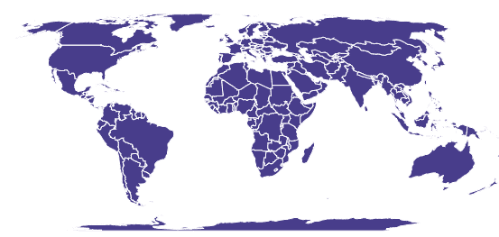
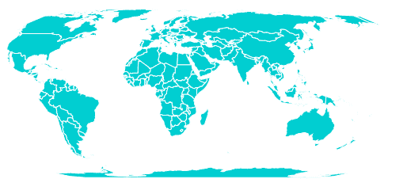

# D3.js geoNellHammer()功能

> 原文:[https://www.geeksforgeeks.org/d3-js-geonellhammer-function/](https://www.geeksforgeeks.org/d3-js-geonellhammer-function/)

JavaScript **D3.js** 库使用 HTML5、可缩放矢量图形和级联样式表为网页提供交互式数据可视化。 **d3.js** 中的 **geoNellHammer** ()功能用于绘制**Nell–Hammer**投影。

**语法:**

```
d3.geoNellHammer()
```

**参数:**此方法不接受任何参数。

**返回:**该方法根据给定的 JSON 数据创建内尔-哈默投影。

**示例#1:** 以下示例创建世界的 Nell-Hammer 投影，中心位于(0，0)且无旋转。

```
<!DOCTYPE html>
<html lang="en">
    <head>
        <meta charset="UTF-8" />
        <meta
            name="viewport"
            content="width=device-width, 
                initial-scale=1.0"
        />
    </head>

    <body>
        <div style="width: 700px; height: 500px;">
            <center>
                <h3 style="color: black;"></h3>
            </center>

            <svg width="600" height="450"></svg>
        </div>
        <script src="https://d3js.org/d3.v4.js"></script>
        <script src=
           "https://d3js.org/d3-geo-projection.v2.min.js">
      </script>
        <script>

             var svg = d3.select("svg"),
             width = +svg.attr("width"),
             height = +svg.attr("height");

             // Nell–Hammer projection
             // Center(0,0) with 0 rotation
             var gfg = d3.geoNellHammer()
             .scale(width / 1.8 / Math.PI)
             .rotate([0,0])
             .center([0,0])
             .translate([width / 2, height / 2])

            // Loading the json data
            // Used json file stored at 
/*https://raw.githubusercontent.com/janasayantan
            /datageojson/master/world.json*/
            d3.json(
"https://raw.githubusercontent.com/janasayantan/datageojson/master/world.json",
              function(data){

            // Drawing the map
            svg.append("g")
               .selectAll("path")
               .data(data.features)
               .enter().append("path")
                   .attr("fill", "DarkSlateBlue")
                   .attr("d", d3.geoPath()
                   .projection(gfg)
                   )
                   .style("stroke", "#ffff")
            })
        </script>
    </body>
</html>
```

**输出:**



**示例 2:** 在下面的示例中，我们将创建世界的内尔-哈默投影，中心位于(0，20)并且相对于 Y 轴旋转-45 度。

```
<!DOCTYPE html>
<html lang="en">
    <head>
        <meta charset="UTF-8" />
        <meta
            name="viewport"
            content="width=device-width, 
                initial-scale=1.0"
        />
    </head>

    <body>
        <div style="width: 700px; height: 600px;">
            <center>
                <h3 style="color: black;"></h3>
            </center>

            <svg width="500" height="450"></svg>
        </div>
        <script src="https://d3js.org/d3.v4.js"></script>
        <script src=
  "https://d3js.org/d3-geo-projection.v2.min.js">
      </script>
        <script>
            var svg = d3.select("svg"),
                width = +svg.attr("width"),
                height = +svg.attr("height");

            // NellHammer  projection
     // Center(0,20) and -45 degree rotation w.r.t Y axis
            var gfg = d3
                .geoNellHammer()
                .scale(width / 1.7 / Math.PI)
                .rotate([-45, 0])
                .center([0, 20])
                .translate([width / 2, height / 2]);

            // Loading the json data
            // Used json file stored at
          /*https://raw.githubusercontent.com/janasayantan
           /datageojson/master/world.json*/
            d3.json(
"https://raw.githubusercontent.com/janasayantan/datageojson/master/world.json",
              function (data) {
                // Draw the map
                svg.append("g").selectAll(
                  "path").data(data.features).enter().append(
                  "path").attr("fill", "DarkTurquoise").attr(
                  "d", d3.geoPath().projection(gfg)).style(
                  "stroke", "#ffff");
            });
        </script>
    </body>
</html>
```

**输出:**

