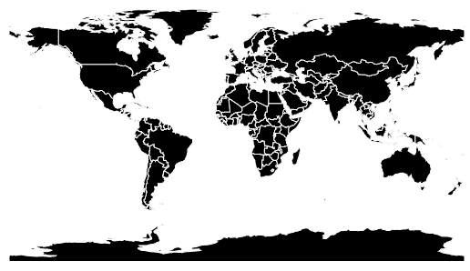
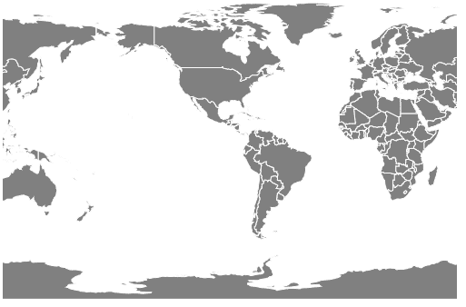

# D3.js geoPatterson()函数

> 原文:[https://www.geeksforgeeks.org/d3-js-geopatterson-function/](https://www.geeksforgeeks.org/d3-js-geopatterson-function/)

JavaScript **D3.js** 库使用 HTML5、可缩放矢量图形和级联样式表为网页提供交互式数据可视化。 **d3.js** 中的**地球图案**()功能用于绘制**帕特森圆柱形**投影。

**语法:**

```
d3.geoPatterson()
```

**参数:**此方法不接受任何参数。

**返回值:**该方法根据给定的 JSON 数据创建帕特森圆柱投影。

**示例 1:** 以下示例创建了以(0，0)为中心且无旋转的帕特森世界投影。

## 超文本标记语言

```
<!DOCTYPE html> 
<html lang="en"> 

<head> 
    <meta charset="UTF-8" /> 
    <meta name="viewport"
        content="width=device-width, 
                initial-scale=1.0"/> 
</head> 
<body> 
    <div style="width:700px; height:500px;"> 
        <center>  
            <h3 style="color:black"></h3>  
        </center>

        <svg width="600" height="450"> 
        </svg> 
    </div> 
    <script src="https://d3js.org/d3.v4.js"></script>
    <script src=
"https://d3js.org/d3-geo-projection.v2.min.js">
    </script>

    <script>

        var svg = d3.select("svg"),
        width = +svg.attr("width"),
        height = +svg.attr("height");

        // Patterson projection
        // Center(0,0) with 0 rotation
        var gfg = d3.geoPatterson()
                   .scale(width / 2.4 / Math.PI)
                 .rotate([0,0])
                 .center([0,0])
                 .translate([width / 2, height / 2])

        // Loading the json data
        // Used json file stored at 
        // https://raw.githubusercontent.com/janasayantan
        // /datageojson/master/world.json
        d3.json("https://raw.githubusercontent.com/"
            + "janasayantan/datageojson/master/world.json", 
            function(data){

           // Drawing the map
           svg.append("g")
              .selectAll("path")
              .data(data.features)
              .enter().append("path")
              .attr("fill", "Black")
              .attr("d", d3.geoPath()
                   .projection(gfg)
               )
              .style("stroke", "#ffff")
        })
    </script>
</body>

</html>
```

**输出:**



**示例 2:** 在下面的示例中，我们将创建以(0，-20)为中心并相对于 Y 轴旋转 90 度的帕特森世界投影。

## 超文本标记语言

```
<!DOCTYPE html> 
<html lang="en"> 

<head> 
    <meta charset="UTF-8" /> 
    <meta name="viewport"
        content="width=device-width, 
                initial-scale=1.0"/> 
    <script src="https://d3js.org/d3.v4.js"></script>
    <script src=
"https://d3js.org/d3-geo-projection.v2.min.js">
    </script>
</head> 

<body> 
    <div style="width:700px; height:600px;"> 
        <center> 
            <h3 style="color:black"></h3>  
        </center>
        <svg width="500" height="450"> 
        </svg> 
    </div> 

    <script>

        var svg = d3.select("svg"),
        width = +svg.attr("width"),
        height = +svg.attr("height");

        // Patterson  projection
        // Center(0,-20) and 90 degree
        // rotation w.r.t Y axis
        var gfg = d3.geoPatterson()
                 .scale(width / 1.7 / Math.PI)
                 .rotate([90,0])
                 .center([0,-20])
                 .translate([width / 2, height / 2])

       // Loading the json data
       // Used json file stored at https:
       //raw.githubusercontent.com/janasayantan
       // /datageojson/master/world.json
       d3.json("https://raw.githubusercontent.com/janasayantan/"
               +"datageojson/master/world.json", function(data){

              // Draw the map
              svg.append("g")
                 .selectAll("path")
                 .data(data.features)
                 .enter().append("path")
                 .attr("fill", "grey")
                 .attr("d", d3.geoPath()
                       .projection(gfg)
                 )
                 .style("stroke", "#ffff")
        })
    </script>
</body> 

</html>
```

**输出:**

