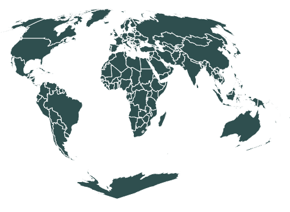
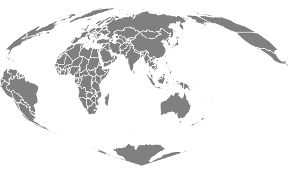

# D3 . js geosinumlweide()函数

> 原文:[https://www . geeksforgeeks . org/D3-js-geosinumulweide-function/](https://www.geeksforgeeks.org/d3-js-geosinumollweide-function/)

JavaScript **D3.js** 库使用 HTML5、可缩放矢量图形和级联样式表为网页提供交互式数据可视化。
在 **d3.js** 中的**geosinimulweide**()功能用于绘制艾伦·k·菲尔布里克的 **Sinu-Mollweide** 投影。

**语法:**

```
d3.geoSinuMollweide()
```

**参数:**此方法不接受任何参数。

**返回值:**该方法根据给定的 JSON 数据创建 Sinu-Mollweide 投影。

**示例 1:** 以下示例创建世界的 SinuMollweide 投影，中心位于(0，0)且无旋转。

```
<!DOCTYPE html>
<html lang="en">

<head>
    <meta charset="UTF-8" />
    <meta name="viewport" content="width=device-width, 
                initial-scale=1.0" />
</head>

<body>
    <div style="width: 700px; height: 500px;">
        <center>
            <h3 style="color: black;"></h3>
        </center>

        <svg width="600" height="450"></svg>
    </div>
    <script src="https://d3js.org/d3.v4.js"></script>
    <script src=
    "https://d3js.org/d3-geo-projection.v2.min.js">
    </script>

    <script>
        var svg = d3.select("svg"),
            width = +svg.attr("width"),
            height = +svg.attr("height");

        // SinuMollweide projection
        // Center(0, 0) with 0 rotation
        var gfg = d3
            .geoSinuMollweide()
            .scale(width / 1.8 / Math.PI)
            .rotate([0, 0])
            .center([0, 0])
            .translate([width / 2, height / 2]);

        // Loading the json data
        // Used json file stored at 
        /*https://raw.githubusercontent.com/janasayantan
                    /datageojson/master/world.json*/
        d3.json("https://raw.githubusercontent.com/"
            + "janasayantan/datageojson/master/world.json",
            function (data) {

                // Drawing the map
                svg.append("g").selectAll("path")
                    .data(data.features).enter().append("path")
                    .attr("fill", "DarkSlateGrey")
                    .attr("d", d3.geoPath().projection(gfg))
                    .style("stroke", "#ffff");
            });
    </script>
</body>

</html>
```

输出:



**示例 2:** 在下面的示例中，我们将创建以(10，0)为中心并相对于 Y 轴旋转-90 度的 SinuMollweide 世界投影。

```
<!DOCTYPE html>
<html lang="en">

<head>
    <meta charset="UTF-8" />
    <meta name="viewport" content="width=device-width, 
                initial-scale=1.0" />
</head>

<body>
    <div style="width: 700px; height: 600px;">
        <center>
            <h3 style="color: black;"></h3>
        </center>

        <svg width="500" height="450"></svg>
    </div>
    <script src="https://d3js.org/d3.v4.js"></script>
    <script src=
    "https://d3js.org/d3-geo-projection.v2.min.js">
    </script>

    <script>
        var svg = d3.select("svg"),
            width = +svg.attr("width"),
            height = +svg.attr("height");

        // SinuMollweide  projection
        // Center(10, 0) and -90 degree
        // rotation w.r.t Y axis
        var gfg = d3
            .geoSinuMollweide()
            .scale(width / 1.8 / Math.PI)
            .rotate([-90, 0])
            .center([10, 0])
            .translate([width / 2, height / 2]);

        // Loading the json data
        // Used json file stored at 
        /*https://raw.githubusercontent.com/janasayantan
                    /datageojson/master/world.json */
        d3.json("https://raw.githubusercontent.com/"
            + "janasayantan/datageojson/master/world.json",
            function (data) {
                // Draw the map
                svg.append("g").selectAll("path")
                    .data(data.features).enter()
                    .append("path").attr("fill", "grey")
                    .attr("d", d3.geoPath().projection(gfg))
                    .style("stroke", "#ffff");
            });
    </script>
</body>

</html>
```

**输出:**

