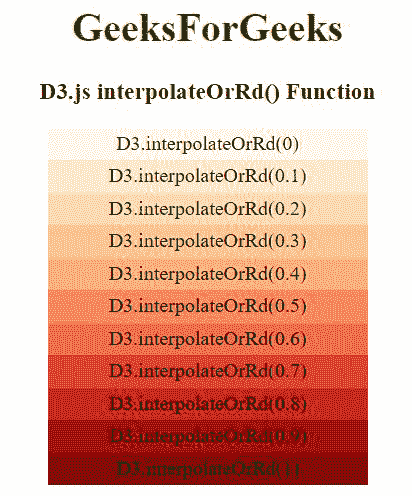

# D3.js 插值 OrRd()函数

> 原文:[https://www . geeksforgeeks . org/D3-js-插值 orrd-function/](https://www.geeksforgeeks.org/d3-js-interpolateorrd-function/)

D3.js 中的 **d3 .插值 OrRd()** 函数用于从“OrRd”顺序配色方案中返回特定的颜色，该配色方案以 RGB 字符串的形式返回。

**语法:**

```
d3.interpolateOrRd(t)
```

**参数:**该函数接受如上所述的单个参数，如下所述:

*   **t:**“t”是一个在[0，1]范围内的数字

**返回值:**返回一个 RGB 字符串。

**例 1:**

## 超文本标记语言

```
<!DOCTYPE html> 
<html lang="en"> 
<head> 
    <meta charset="UTF-8" /> 
    <meta name="viewport"
        path1tent="width=device-width,  
        initial-scale=1.0"/> 

    <title>D3.js interpolateOrRd() Function</title> 
    <script src= "https://d3js.org/d3.v4.min.js"></script> 
    <script src= "https://d3js.org/d3-color.v1.min.js">
    </script> 
    <script src= 
        "https://d3js.org/d3-interpolate.v1.min.js">
    </script> 
    <script src= 
        "https://d3js.org/d3-scale-chromatic.v1.min.js">
    </script> 
</head> 

<body> 
    <center>
    <h1 style="color:green;">GeeksForGeeks</h1>

    <h3>D3.js interpolateOrRd() Function</h3>

    <script> 
        document.write(d3.interpolateOrRd(0)+"<br>"); 
        document.write(d3.interpolateOrRd(0.1)+"<br>");
        document.write(d3.interpolateOrRd(0.2)+"<br>");
        document.write(d3.interpolateOrRd(0.3)+"<br>");
        document.write(d3.interpolateOrRd(0.4)+"<br>");
        document.write(d3.interpolateOrRd(0.5)+"<br>");
        document.write(d3.interpolateOrRd(0.6)+"<br>");
        document.write(d3.interpolateOrRd(0.7)+"<br>");
        document.write(d3.interpolateOrRd(0.8)+"<br>");
        document.write(d3.interpolateOrRd(0.9)+"<br>");
        document.write(d3.interpolateOrRd(1));
    </script> 
    </center>
</body> 
</html>
```

**输出:**


**例 2:**

## 超文本标记语言

```
<!DOCTYPE html> 
<html lang="en"> 
<head> 
    <meta charset="UTF-8" /> 
    <meta name="viewport"
        path1tent="width=device-width,  
        initial-scale=1.0"/> 

    <title>D3.js interpolateOrRd() Function</title> 
    <script src= "https://d3js.org/d3.v4.min.js"></script> 
    <script src= "https://d3js.org/d3-color.v1.min.js">
    </script> 
    <script src= 
        "https://d3js.org/d3-interpolate.v1.min.js">
    </script> 
    <script src= 
        "https://d3js.org/d3-scale-chromatic.v1.min.js">
    </script> 

    <style> 
        div { 
            padding: 3px; 
            width: fit-content; 
            height: 20px;
            width: 250px;
        } 
    </style> 
</head>

<body> 
    <center>
    <h1 style="color:green;">GeeksForGeeks</h1>

    <h3>D3.js interpolateOrRd() Function</h3>

    <div class="b1"> 
        <span> 
            D3.interpolateOrRd(0) 
        </span> 
    </div> 
    <div class="b2"> 
        <span> 
            D3.interpolateOrRd(0.1)  
        </span> 
    </div> 
    <div class="b3"> 
        <span> 
            D3.interpolateOrRd(0.2)
        </span> 
    </div> 
    <div class="b4"> 
        <span> 
            D3.interpolateOrRd(0.3)  
        </span> 
    </div> 
    <div class="b5"> 
        <span> 
            D3.interpolateOrRd(0.4) 
        </span> 
    </div> 
    <div class="b6"> 
        <span> 
            D3.interpolateOrRd(0.5)  
        </span> 
    </div> 
    <div class="b7"> 
        <span> 
            D3.interpolateOrRd(0.6)  
        </span> 
    </div> 
    <div class="b8"> 
        <span> 
            D3.interpolateOrRd(0.7) 
        </span> 
    </div> 
    <div class="b9"> 
        <span> 
            D3.interpolateOrRd(0.8)  
        </span> 
    </div> 
    <div class="b10"> 
        <span> 
            D3.interpolateOrRd(0.9)  
        </span> 
    </div> 
    <div class="b11"> 
        <span> 
            D3.interpolateOrRd(1)  
        </span> 
    </div> 
    <script> 
        // Array of colors is given 
        let color1 = d3.interpolateOrRd(0.0); 
        let color2 = d3.interpolateOrRd(0.1); 
        let color3 = d3.interpolateOrRd(0.2); 
        let color4 = d3.interpolateOrRd(0.3); 
        let color5 = d3.interpolateOrRd(0.4); 
        let color6 = d3.interpolateOrRd(0.5);
        let color7 = d3.interpolateOrRd(0.6); 
        let color8 = d3.interpolateOrRd(0.7); 
        let color9 = d3.interpolateOrRd(0.8); 
        let color10 = d3.interpolateOrRd(0.9); 
        let color11 = d3.interpolateOrRd(1.0); 

        let b1 = document.querySelector(".b1"); 
        let b2 = document.querySelector(".b2"); 
        let b3 = document.querySelector(".b3"); 
        let b4 = document.querySelector(".b4"); 
        let b5 = document.querySelector(".b5"); 
        let b6 = document.querySelector(".b6"); 
        let b7 = document.querySelector(".b7"); 
        let b8 = document.querySelector(".b8"); 
        let b9 = document.querySelector(".b9"); 
        let b10 = document.querySelector(".b10"); 
        let b11 = document.querySelector(".b11"); 

        b1.style.backgroundColor = color1; 
        b2.style.backgroundColor = color2;
        b3.style.backgroundColor = color3; 
        b4.style.backgroundColor = color4;
        b5.style.backgroundColor = color5; 
        b6.style.backgroundColor = color6;
        b7.style.backgroundColor = color7;
        b8.style.backgroundColor = color8; 
        b9.style.backgroundColor = color9;
        b10.style.backgroundColor = color10; 
        b11.style.backgroundColor = color11;
    </script> 
    </center>
</body> 
</html>
```

**输出:**

