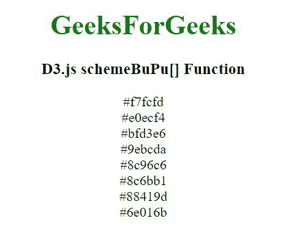
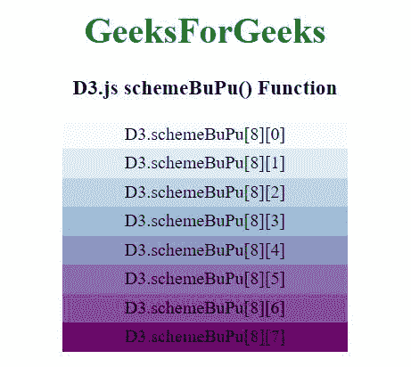

# D3.js schemeBuPu【】功能

> 原文:[https://www.geeksforgeeks.org/d3-js-schemebupu-function/](https://www.geeksforgeeks.org/d3-js-schemebupu-function/)

**D3.js** 中的**D3 . scheme BuPu【】**函数用于从*【BuPu】*顺序配色方案中返回特定颜色，该配色方案以十六进制字符串的形式返回。

**语法:**

```
d3.schemeBuPu[k]
```

**参数:**该函数接受一个参数，如上所述，如下所述。

*   **k:**“k”是 3 到 9 之间的数字。

**返回值:**返回一个十六进制字符串。

**例 1:**

## 超文本标记语言

```
<!DOCTYPE html> 
<html lang="en"> 
<head> 
    <meta charset="UTF-8" /> 
    <meta name="viewport"
        path1tent="width=device-width,  
        initial-scale=1.0"/> 

    <script src= "
     https://d3js.org/d3.v4.min.js">
    </script> 
    <script src= "
     https://d3js.org/d3-color.v1.min.js">
    </script> 
    <script src= "
    https://d3js.org/d3-interpolate.v1.min.js">
    </script> 
    <script src= "
     https://d3js.org/d3-scale-chromatic.v1.min.js">
    </script> 
</head> 

<body> 
    <center>
    <h1 style="color:green;">GeeksForGeeks</h1>

    <h3>D3.js schemeBuPu[] Function</h3>

    <script> 
        document.write(d3.schemeBuPu[8][0]+"<br>"); 
        document.write(d3.schemeBuPu[8][1]+"<br>");
        document.write(d3.schemeBuPu[8][2]+"<br>");
        document.write(d3.schemeBuPu[8][3]+"<br>");
        document.write(d3.schemeBuPu[8][4]+"<br>");
        document.write(d3.schemeBuPu[8][5]+"<br>");
        document.write(d3.schemeBuPu[8][6]+"<br>");
        document.write(d3.schemeBuPu[8][7]+"<br>");
    </script> 
    </center>
</body> 
</html>
```

**输出:**



**例 2:**

## 超文本标记语言

```
<!DOCTYPE html> 
<html lang="en"> 
<head> 
    <meta charset="UTF-8" /> 
    <meta name="viewport"
        path1tent="width=device-width,  
        initial-scale=1.0"/> 

    <script src= "
     https://d3js.org/d3.v4.min.js">
    </script> 
    <script src= "
     https://d3js.org/d3-color.v1.min.js">
    </script> 
    <script src= "
    https://d3js.org/d3-interpolate.v1.min.js">
    </script> 
    <script src= "
    https://d3js.org/d3-scale-chromatic.v1.min.js">
    </script> 

    <style> 
        div { 
            padding: 3px; 
            width: fit-content; 
            height: 20px;
            width: 250px;
        } 
    </style> 
</head>

<body> 
    <center>
    <h1 style="color:green;">GeeksForGeeks</h1>

    <h3>D3.js schemeBuPu() Function</h3>

    <div class="b1"> 
        <span> 
            D3.schemeBuPu[8][0] 
        </span> 
    </div> 
    <div class="b2"> 
        <span> 
            D3.schemeBuPu[8][1]   
        </span> 
    </div> 
    <div class="b3"> 
        <span> 
            D3.schemeBuPu[8][2] 
        </span> 
    </div> 
    <div class="b4"> 
        <span> 
            D3.schemeBuPu[8][3]  
        </span> 
    </div> 
    <div class="b5"> 
        <span> 
            D3.schemeBuPu[8][4] 
        </span> 
    </div> 
    <div class="b6"> 
        <span> 
            D3.schemeBuPu[8][5]  
        </span> 
    </div> 
    <div class="b7"> 
        <span> 
            D3.schemeBuPu[8][6]  
        </span> 
    </div> 
    <div class="b8"> 
        <span> 
            D3.schemeBuPu[8][7] 
        </span> 
    </div> 
    <script> 
        // Array of colors is given 
        let color1 = d3.schemeBuPu[8][0]; 
        let color2 = d3.schemeBuPu[8][1]; 
        let color3 = d3.schemeBuPu[8][2]; 
        let color4 = d3.schemeBuPu[8][3]; 
        let color5 = d3.schemeBuPu[8][4]; 
        let color6 = d3.schemeBuPu[8][5];
        let color7 = d3.schemeBuPu[8][6]; 
        let color8 = d3.schemeBuPu[8][7]; 

        let b1 = document.querySelector(".b1"); 
        let b2 = document.querySelector(".b2"); 
        let b3 = document.querySelector(".b3"); 
        let b4 = document.querySelector(".b4"); 
        let b5 = document.querySelector(".b5"); 
        let b6 = document.querySelector(".b6"); 
        let b7 = document.querySelector(".b7"); 
        let b8 = document.querySelector(".b8"); 

        b1.style.backgroundColor = color1; 
        b2.style.backgroundColor = color2;
        b3.style.backgroundColor = color3; 
        b4.style.backgroundColor = color4;
        b5.style.backgroundColor = color5; 
        b6.style.backgroundColor = color6;
        b7.style.backgroundColor = color7;
        b8.style.backgroundColor = color8; 
    </script> 
    </center>
</body> 
</html>
```

**输出:**

