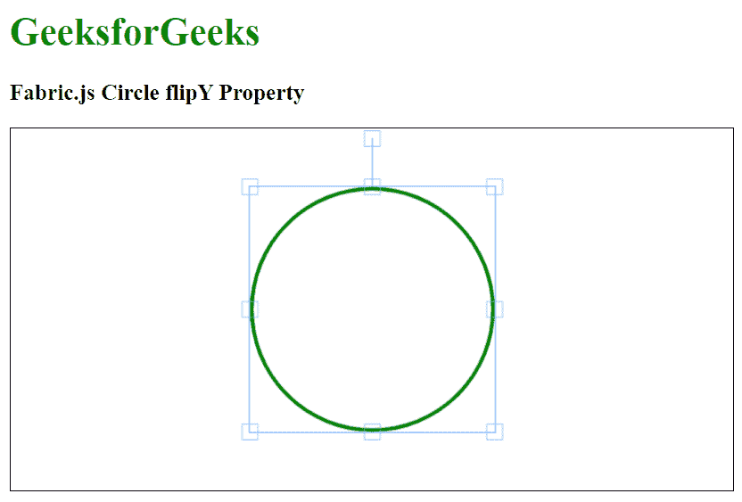

# Fabric.js 循环动画属性

> 原文:[https://www . geesforgeks . org/fabric-js-circle-flipy-property/](https://www.geeksforgeeks.org/fabric-js-circle-flipy-property/)

在本文中，我们将看到如何使用 **FabricJS** 垂直翻转圆形画布。帆布圈是可移动的，可以根据需要拉伸。此外，当涉及到初始*笔画颜色、高度、宽度、填充颜色、*或*笔画宽度*时，可以自定义圆圈。

为了实现这一点，我们将使用一个名为 **FabricJS** 的 JavaScript 库。导入库后，我们将在主体标签中创建一个包含圆圈的画布块。之后，我们将初始化由 **FabricJS** 提供的画布圆的实例，并设置 *flipY* 属性，并在画布上渲染圆，如下例所示。

**语法:**

```
fabric.Circle({
   radius: number,
   flipY: Boolean
});
```

**参数:**该函数接受两个参数，如上所述，如下所述。

*   **半径:**指定圆的半径。
*   **翻转:**指定对象垂直翻转。

**示例:**本示例使用 **FabricJS** 垂直翻转画布圆圈。

## 超文本标记语言

```
<!DOCTYPE html>
<html>

<head>

    <!-- FabricJS CDN -->
    <script src=
"https://cdnjs.cloudflare.com/ajax/libs/fabric.js/3.6.2/fabric.min.js">
    </script>
</head>

<body>
    <h1 style="color: green;">
        GeeksforGeeks
    </h1>

    <h3>
        Fabric.js Circle flipY Property
    </h3>

    <canvas id="canvas" width="600" height="300"
        style="border:1px solid #000000">
    </canvas>

    <script>

        // Initiate a Canvas instance 
        var canvas = new fabric.Canvas("canvas");

        // Initiate a Circle instance 
        var circle = new fabric.Circle({
            radius: 100,
            fill: '',
            stroke: 'green',
            strokeWidth: 3,
            flipX: false,
            flipY: true
        });

        // Render the circle in canvas 
        canvas.add(circle);
        canvas.centerObject(circle);
    </script>
</body>

</html>
```

**输出:**

