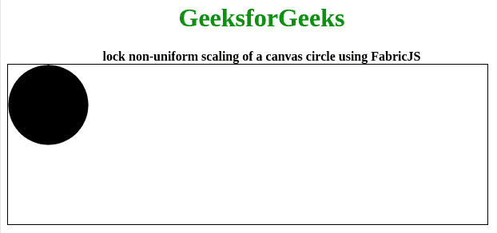

# Fabric.js |圆锁定缩放属性

> 原文:[https://www . geesforgeks . org/fabric-js-circle-lock uniscaling-property/](https://www.geeksforgeeks.org/fabric-js-circle-lockuniscaling-property/)

在本文中，我们将看到如何使用 FabricJS 锁定画布圆的非均匀缩放，从而保持对象的纵横比。画布意味着圆是可移动的，可以根据需要拉伸。此外，当涉及到初始笔画颜色、填充颜色、笔画宽度或半径时，可以对圆进行自定义。

为了实现这一点，我们将使用一个名为 FabricJS 的 JavaScript 库。使用 CDN 导入库后，我们将在主体标签中创建一个包含我们的圆的*画布*块。之后，我们将初始化由 FabricJS 提供的 Canvas 和 Circle 实例，并使用**锁定缩放**属性锁定非均匀缩放圆形，并在 Canvas 上渲染圆形，如下例所示。

**语法:**

```
fabric.Circle({
    radius: number,
    lockUniScaling: boolean
}); 
```

**参数:**该函数接受两个参数，如上所述，如下所述:

*   **半径:**此参数指定圆的半径。
*   **锁定缩放:**此参数指定是否锁定非均匀缩放。

**示例:**本示例使用 FabricJS 锁定画布圆的非均匀缩放。

```
<!DOCTYPE hyml>
<html>

<head>
    <title> 
        Fabric.js | Circle lockUniScaling Property
    </title>

    <!-- FabricJS CDN -->
    <script src=
"https://cdnjs.cloudflare.com/ajax/libs/fabric.js/3.6.2/fabric.min.js">
    </script>
</head>

<body>
    <center>
        <h1 style="color: green;">
            GeeksforGeeks
        </h1>

        <b>
            lock non-uniform scaling of a canvas 
            circle using FabricJS
        </b>
    </center>

    <canvas id="canvas" width="600" height="200" 
        style="border:1px solid #000000">
    </canvas>

    <script>

        // Initiate a Canvas instance
        var canvas = new fabric.Canvas("canvas");

        // Initiate a Circle instance
        var circle = new fabric.Circle({
            radius: 50,
            lockUniScaling: true
        });

        // Render the circle in canvas
        canvas.add(circle);
    </script>
</body> 

</html>                   
```

**输出:**
