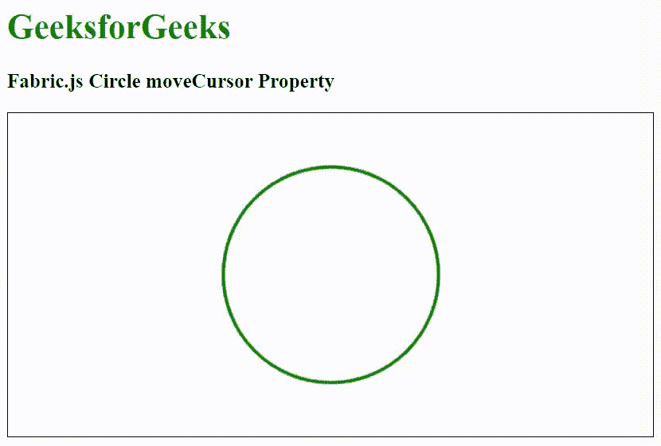

# 织物. js 圆周运动光标属性

> 原文:[https://www . geesforgeks . org/fabric-js-circle-move cursor-property/](https://www.geeksforgeeks.org/fabric-js-circle-movecursor-property/)

在本文中，我们将看到如何使用 Fabric.js 设置画布圆的 moveCursor 属性。Fabric.js 中的圆是可移动的，可以根据需要进行拉伸。此外，当涉及到初始笔画颜色、填充颜色、笔画宽度或大小时，可以自定义圆形。

为了实现这一点，我们将使用一个名为 Fabric.js 的 JavaScript 库。导入库后，我们将在主体标签中创建一个包含 Circle 的画布块。之后，我们将初始化 Fabric.js 提供的 Canvas 和 Circle 实例，使用 moveCursor 属性设置移动 Circle 时要使用的光标，并在 Canvas 上渲染 Circle，如下例所示。

**语法:**

```
fabric.Circle({
   radius: number,
   moveCursor: string
});
```

**参数:**该函数接受两个参数，如上所述，如下所述:

*   **半径:**指定圆的半径。
*   **移动光标:**指定移动圆时要使用的光标。

**示例:**本示例使用 Fabric.js 设置 moveCursor 值，该值将指定对象移动时显示的光标。

## 超文本标记语言

```
<html>
<head>
    <!-- FabricJS CDN -->
    <script src=
"https://cdnjs.cloudflare.com/ajax/libs/fabric.js/3.6.2/fabric.min.js">
    </script>
</head>
<body>
    <h1 style="color: green;">
        GeeksforGeeks
    </h1>
    <h3>
        Fabric.js Circle moveCursor Property
    </h3>
    <canvas id="canvas" width="600" height="300" 
            style="border:1px solid #000000">
    </canvas>
    <script>
        // Initiate a Canvas instance 
        var canvas = new fabric.Canvas("canvas");

        // Initiate a Circle instance 
        var circle = new fabric.Circle({
            radius: 100,
            fill: '',
            stroke: 'green',
            strokeWidth: 3,
            moveCursor: 'pointer'
        });

        // Render the circle in canvas 
        canvas.add(circle);
        canvas.centerObject(circle);
    </script>
</body>
</html>
```

**输出:**

