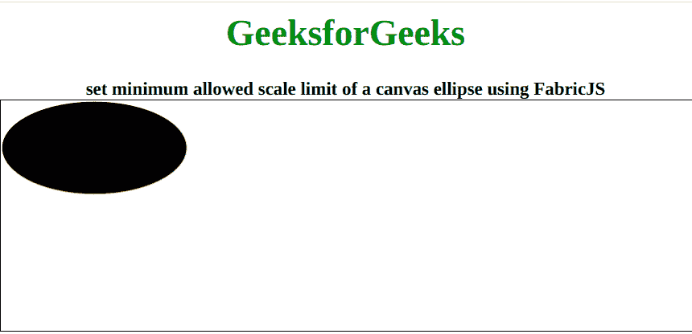

# Fabric.js |椭圆 minScaleLimit 属性

> 原文:[https://www . geeksforgeeks . org/fabric-js-ellipse-minscalelimit-property/](https://www.geeksforgeeks.org/fabric-js-ellipse-minscalelimit-property/)

在本文中，我们将看到如何使用 FabricJS 设置画布椭圆的最小允许比例限制，以便保持对象的纵横比。画布意味着椭圆是可移动的，可以根据需要拉伸。此外，当涉及到初始笔画颜色、填充颜色、笔画宽度或半径时，可以自定义椭圆。

**方法:**为了使其成为可能，我们将使用一个名为 FabricJS 的 JavaScript 库。使用 CDN 导入库后，我们将在主体标签中创建一个包含我们的椭圆的*画布*块。之后，我们将初始化由 FabricJS 提供的 canvas 和 Ellipse 的实例，并使用 **minScaleLimit** 属性设置 Canvas 椭圆的最小允许比例限制，并在 Canvas 上渲染椭圆，如下例所示。

**语法:**

```
fabric.Ellipse({
    rx: number,
    ry: number,
    minScaleLimit: number
}); 
```

**参数:**该功能接受三个参数，如上所述，描述如下:

*   **rx:** 指定水平半径。
*   **ry:** 指定垂直半径。
*   **明刻度极限:**指定最小刻度极限。

**示例:**本示例使用 FabricJS 设置画布椭圆的最小允许比例限制。

```
<!DOCTYPE html>
<html>

<head>
    <title> 
        Fabric.js | Ellipse minScaleLimit Property
    </title>

    <!-- FabricJS CDN -->
    <script src=
"https://cdnjs.cloudflare.com/ajax/libs/fabric.js/3.6.2/fabric.min.js">
    </script>
</head>

<body>
    <div style="text-align: center;width: 600px;">
        <h1 style="color: green;">
            GeeksforGeeks
        </h1>

        <b>
            set minimum allowed scale limit of a canvas
            ellipse using FabricJS
        </b>
    </div>

    <div style="text-align: center;">
        <canvas id="canvas" width="600" height="200"
            style="border:1px solid #000000;">
        </canvas>
    </div>

    <script>

        // Initiate a Canvas instance
        var canvas = new fabric.Canvas("canvas");

        // Initiate a Ellipse instance
        var ellipse = new fabric.Ellipse({
            rx: 80,
            ry: 40,
            minScaleLimit: 1
        });

        // Render the Ellipse in canvas
        canvas.add(ellipse);
    </script>
</body>

</html>                   
```

**输出:**
