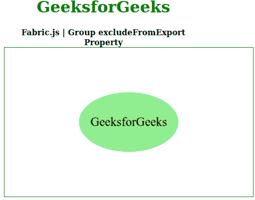

# Fabric.js 集团 excludeFromExport 物业

> 原文:[https://www . geesforgeks . org/fabric-js-group-excludefromexport-property/](https://www.geeksforgeeks.org/fabric-js-group-excludefromexport-property/)

在本文中，我们将看到如何使用**织物. js** 设置画布的**组**的**排除导出**。Fabric.js 中的组是可移动的，可以根据需要拉伸。此外，当涉及到初始笔画颜色、高度、宽度、填充颜色或笔画宽度时，可以自定义该组。

为了实现这一点，我们将使用一个名为 **Fabric.js** 的 JavaScript 库。导入库后，我们将在主体标签中创建一个包含组的画布块。之后，我们将初始化 **Fabric.js** 提供的 canvas 和 Group 的实例，使用**excludeforromexport**属性禁用 canvas Group 的 Canvas 点击属性。

**语法:**

```
fabric.Group([canvas1, canvas2], {
   excludeFromExport: Boolean
});
```

**参数:**该属性接受如上所述的单个参数，如下所述:

*   **exclude defromexport:**设置为‘真’时，对象不在 OBJECT/JSON 中导出。

下面的例子说明了 fabric . js Group**excludeforromexport**属性的使用。

**示例:**

## 超文本标记语言

```
<html>
<head>
  <!-- FabricJS CDN -->
  <script src=
"https://cdnjs.cloudflare.com/ajax/libs/fabric.js/3.6.2/fabric.min.js">
  </script>
</head>
<body>
    <div style="text-align: center;width: 400px;">
      <h1 style="color: green;">
          GeeksforGeeks
      </h1>
      <b>
          Fabric.js | Group excludeFromExport Property
      </b>
    </div>
    <div style="text-align: center;">
      <canvas id="canvas" width="500" height="300"
              style="border:1px solid green;">
      </canvas>
    </div>
    <script>
      // Initiate a Canvas instance
      var canvas = 
          new fabric.Canvas("canvas");

      // Initiate a circle instance
      var circle = 
          new fabric.Circle({
        radius: 100,
        fill: 'lightgreen',
        scaleY: 0.6,
        originX: 'center',
        originY: 'center'
      });

      // Initiate a text instance
      var text = 
          new fabric.Text('GeeksforGeeks', {
        fontSize: 25,
        originX: 'center',
        originY: 'center'
      });

      // Initiate a Group instance
      var group = 
          new fabric.Group([ circle, text ], {
        excludeFromExport: false  
      });

      // Render the Group in canvas
      canvas.add(group);

      // Center the Group in canvas
      canvas.centerObject(group);
  </script>
</body>
</html>
```

**输出:**

