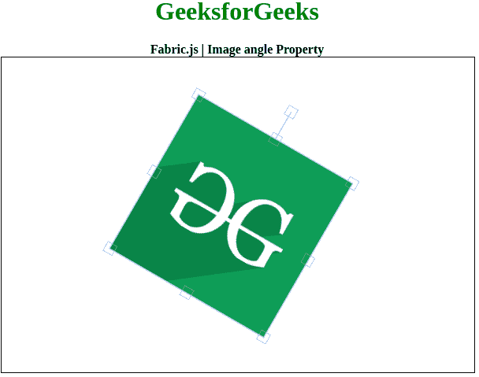

# 织物. js |图像角度属性

> 原文:[https://www . geesforgeks . org/fabric-js-image-angle-property/](https://www.geeksforgeeks.org/fabric-js-image-angle-property/)

在本文中，我们将看到如何使用 FabricJS 设置画布图像的角度。画布意味着图像是可移动的，可以根据需要拉伸。此外，当涉及角度、笔画宽度、填充等时，可以定制图像。

为了实现这一点，我们将使用一个名为 FabricJS 的 JavaScript 库。导入库后，我们将在主体标签中创建一个包含图像的画布块。此外，我们将创建一个 **img** 元素，该元素包含要添加到画布内部的图像，并将样式属性设置为**显示:无；**因为我们不希望图像在画布外可见。之后，我们将初始化由 FabricJS 提供的 canvas 和 Image 的实例，并在 Canvas 上渲染 Image，并使用**角度**属性设置 Canvas 图像的角度，如下例所示。

**语法:**

```
fabric.Image({
    image,
    angle: number
}); 
```

**参数:**该函数接受两个参数，如上所述，如下所述:

*   **图像:**指定图像对象。
*   **角度:**指定图像的角度，单位为度。

**示例:**本示例使用 FabricJS 设置画布图像的角度。

```
<!DOCTYPE html>
<html>

<head>
    <title> 
        Fabric.js | Image angle Property
    </title>

    <!-- FabricJS CDN -->
    <script src=
"https://cdnjs.cloudflare.com/ajax/libs/fabric.js/3.6.2/fabric.min.js">
    </script>
</head>

<body>
    <div style="text-align: center;width: 600px;">
        <h1 style="color: green;">
            GeeksforGeeks
        </h1>
        <b>
            Fabric.js | Image angle Property
        </b>
    </div>

    <div style="text-align: center;">
        <canvas id="canvas" width="600" height="400" 
                style="border:1px solid #000000;">
        </canvas>
    </div>

    <!-- Add the image to be used in the canvas and hide it here 
         because only need it inside the canvas -->
    

    <script>
        // Initiate a Canvas instance
        var canvas = new fabric.Canvas("canvas");

        // Get the image element
        var image = document.getElementById('my-image');

        // Initiate a Fabric instance
        var fabricImage = new fabric.Image(image, {
            angle: 30
        });

        // Add the image to canvas
        canvas.add(fabricImage);
    </script>
</body>

</html>                   
```

**输出:**
