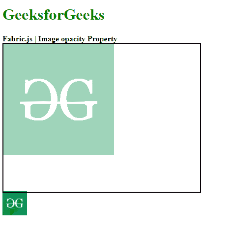
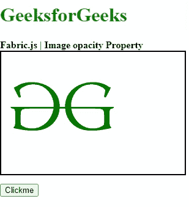

# 织物. js 图像不透明度属性

> 原文:[https://www . geesforgeks . org/fabric-js-image-opacity-property/](https://www.geeksforgeeks.org/fabric-js-image-opacity-property/)

**Fabric.js** 是一个用来处理画布的 javascript 库。Image 是 fabric.js 的一个类，用于创建图像实例。图像的不透明度属性用于设置图像的可见性。

首先导入 fabric.js 库。导入库后，在主体标签中创建一个包含图像的画布块。之后，初始化一个由 FabricJS 提供的 canvas 和图像的实例，并使用图像对象的不透明度属性设置 Canvas 图像的不透明度。

**语法:**

```
fabric.Image(image, {
   opacity: 0.40
 });

```

**参数:**上述函数取两个参数，如上所述，描述如下:

*   **图像:**该参数取图像。
*   **不透明度:**设置图像的不透明度。

**示例 1:** 本示例使用 FabricJS 设置画布图像的不透明度，如下例所示。

```
<!DOCTYPE html> 
<html> 

<head> 
    <!-- Adding the FabricJS library --> 
    <script src= 
"https://cdnjs.cloudflare.com/ajax/libs/fabric.js/3.6.2/fabric.min.js"> 
    </script> 
</head> 

<body> 
    <h1 style="color: green;">GeeksforGeeks</h1> 
    <b>Fabric.js | Image opacity Property </b> 

    <canvas id="canvas" width="400" height="300"
        style="border:2px solid #000000"> 
    </canvas> 

    

    <script> 

        // Create the instance of canvas object
        var canvas = new fabric.Canvas("canvas"); 
        var img= document.getElementById('my-image');
        var imgInstance = new fabric.Image(img, {
            opacity: 0.40
        });
        canvas.add(imgInstance);
    </script> 
</body> 

</html>
```

**输出:**



**例 2:**

```
<!DOCTYPE html> 
<html> 

<head> 
    <!-- Adding the FabricJS library --> 
    <script src= 
"https://cdnjs.cloudflare.com/ajax/libs/fabric.js/3.6.2/fabric.min.js"> 
    </script> 
</head> 

<body> 
    <h1 style="color: green;">GeeksforGeeks</h1> 
    <b>Fabric.js | Image opacity Property </b> 

    <canvas id="canvas" width="300" height="200"
        style="border:2px solid #000000"> 
    </canvas> 

     <br>

    <button onclick="func()">Clickme</button>

    <script>
        // Create the instance of canvas object
        var canvas = new fabric.Canvas("canvas"); 
        var img= document.getElementById('my-image');
        var imgInstance = new fabric.Image(img, {
            opacity: 1
        });

        let func=()=>{
            var imgInstance = new fabric.Image(img, {
                opacity: 0.40
            });
            canvas.clear();
            canvas.add(imgInstance);
        }
        canvas.add(imgInstance);
    </script> 
</body> 

</html>
```

**输出:**

