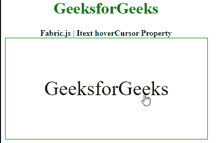

# Fabric.js Itext 悬停光标属性

> 原文:[https://www . geesforgeks . org/fabric-js-itext-悬停光标-property/](https://www.geeksforgeeks.org/fabric-js-itext-hovercursor-property/)

Fabric.js 是一个用于处理画布的 JavaScript 库。画布 Itext 是用于创建 Itext 实例的 Fabric.js 类之一。Fabric.js 中的 Itext 是可移动的，可以根据需要拉伸。在本文中，我们将使用悬停光标属性来设置画布 Itext 中光标的样式。

**接近**:首先导入 Fabric.js 库。导入库后，在主体标签中创建一个包含 Itext 的画布块。之后，初始化一个由 Fabric.js 提供的 canvas 和 Itext 类的实例，使用悬停光标属性来设置光标的样式，并在 Canvas 上呈现 Itext。

**语法**:

```html
fabric.Itext(Itext, {
  hoverCursor : string
});
```

**参数**:该功能接受如上所述的单个参数，描述如下:

*   **悬停光标:**指定光标的样式。

**示例**:本示例使用 Fabric.js 设置画布 Itext 的悬停光标属性，如下例所示:

## 超文本标记语言

```html
<html> 
<head>
  <!-- FabricJS CDN -->
  <script src= 
"https://cdnjs.cloudflare.com/ajax/libs/fabric.js/3.6.2/fabric.min.js"> 
  </script> 
</head> 
<body> 
  <div style="text-align: center;width: 400px;"> 
    <h1 style="color: green;"> 
      GeeksforGeeks 
    </h1>
    <b> 
      Fabric.js | Itext hoverCursor Property 
    </b> 
  </div> 

  <div style="text-align: center;"> 
    <canvas id="canvas" width="400" height="200"
            style="border:1px solid green;"> 
    </canvas> 
  </div> 
  <script> 
    var canvas = 
        new fabric.Canvas("canvas"); 

    var geek = 
        new fabric.IText('GeeksforGeeks', {
        hoverCursor : 'pointer'
    });
    console.log(geek.willDrawShadow())
    canvas.add(geek);
    canvas.centerObject(geek); 
  </script> 
</body> 
</html>
```

**输出:**

