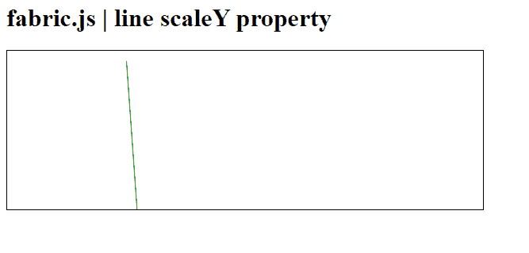
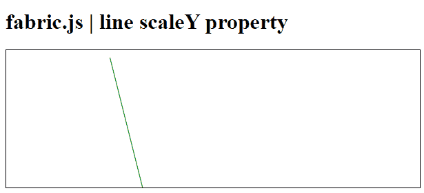

# 布艺 js 线 scaleY 属性

> 原文:[https://www . geesforgeks . org/fabric-js-line-scaley-property/](https://www.geeksforgeeks.org/fabric-js-line-scaley-property/)

在本文中，我们将在 **FabricJS** 中设置画布线的垂直比例。帆布线是指线是可移动的，可以根据需要拉伸。此外，当涉及到初始笔画颜色、高度、宽度、填充颜色或笔画宽度时，可以自定义线条。

**语法:**

```
fabric.line({
    scaleY : number
});
```

**进场:**

*   为了实现这一点，我们将使用一个名为 **FabricJS** 的 JavaScript HTML5 画布库。
*   导入库之后，我们将在主体标签中创建一个画布块，它将包含行。
*   之后，我们将初始化 **FabricJS** 和提供的画布和线条的实例，使用 **scaleY** 属性设置画布线条的垂直比例，并在画布上渲染该线条，如下所示。

**参数:**该函数接受如上所述的单个参数，如下所述:

*   **scaleY:** 指定画布线的垂直比例。包含数值。

**例 1:**

## 超文本标记语言

```
<!DOCTYPE html>
<html>

<head>
    <script src=
"https://cdnjs.cloudflare.com/ajax/libs/fabric.js/3.6.2/fabric.min.js">
    </script>
</head>

<body>
    <h1>fabric.js | line scaleY property</h1>

    <canvas id="canvas" width="600" height="200" 
        style="border:1px solid #000000;"> 
    </canvas>

    <script>
        var canvas = new fabric.Canvas("canvas");

        var line = new fabric.Line([150, 10, 220, 150], {
            stroke: 'green',
            scaleY: 7
        });

        canvas.add(line);
    </script>
</body>

</html> 
```

**输出:**



**例 2:**

## 超文本标记语言

```
<!DOCTYPE html>
<html>

<head>
    <script src=
"https://cdnjs.cloudflare.com/ajax/libs/fabric.js/3.6.2/fabric.min.js">
    </script>
</head>

<body>
    <h1>fabric.js | line scaleY property</h1>

    <canvas id="canvas" width="600" height="200" 
        style="border:1px solid #000000;"> 
    </canvas>

    <script>
        var canvas = new fabric.Canvas("canvas");

        var line = new fabric.Line([150, 10, 220, 150], {
            stroke: 'green',
            scaleY: 2
        });

        canvas.add(line);
    </script>
</body>

</html>
```

**输出:**

