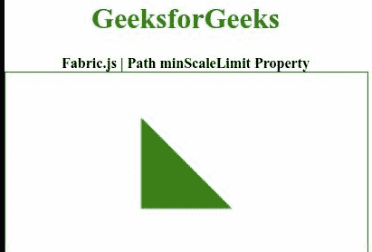

# Fabric.js 路径 minScaleLimit 属性

> 原文:[https://www . geeksforgeeks . org/fabric-js-path-minscalelimit-property/](https://www.geeksforgeeks.org/fabric-js-path-minscalelimit-property/)

在本文中，我们将看到如何使用 **Fabric.js** 设置路径画布对象的 **minScaleLimit** 。Fabric.js 中的 Path 对象是可移动的，可以根据需要进行拉伸。此外，当涉及到初始笔画颜色、高度、宽度、填充颜色或笔画宽度时，可以自定义路径对象。

为了实现这一点，我们将使用一个名为 **Fabric.js** 的 JavaScript 库。导入库后，我们将在主体标签中创建一个包含路径对象的画布块。之后，我们将初始化由 **Fabric.js** 提供的画布和路径对象的实例，并使用 **minScaleLimit** 属性设置路径的最小比例限制。

**语法:**

```
fabric.Path('path', {
   minScaleLimit: Number
});
```

**属性值:**该属性保持如上所述的单一值，如下所述:

*   **最小刻度限制:**它是一个数字，指定路径上要使用的最小刻度限制。

下面的例子说明了在 Fabric.js 中**路径 minScaleLimit** 属性的使用:

**示例:**

## 超文本标记语言

```
<!DOCTYPE html>
<html>

<head>
    <!-- FabricJS CDN -->
    <script src=
"https://cdnjs.cloudflare.com/ajax/libs/fabric.js/3.6.2/fabric.min.js">
    </script>
</head>

<body>
    <div style="text-align: center;width: 400px;">
        <h1 style="color: green;">
            GeeksforGeeks
        </h1>

        <b> 
            Fabric.js | Path minScaleLimit Property 
        </b>
    </div>

    <div style="text-align: center;">
        <canvas id="canvas" width="400" height="200"
            style="border:1px solid green;"> 
        </canvas>
    </div>

    <script>

        // Create a Canvas instance 
        var canvas = new fabric.Canvas("canvas");

        var geek = new fabric.Path(
            'M 0 0 L 100 100 L 0 100 z', {
                fill: 'green',
                minScaleLimit: 1
            });

        canvas.add(geek);
        canvas.centerObject(geek);
    </script>
</body>

</html>
```

**输出:**

