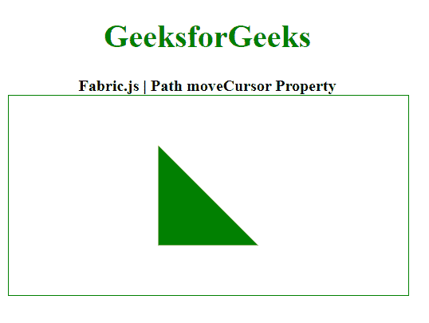

# 织物路径移动光标属性

> 原文:[https://www . geesforgeks . org/fabric-js-path-move cursor-property/](https://www.geeksforgeeks.org/fabric-js-path-movecursor-property/)

在本文中，我们将看到如何使用 **Fabric.js** 设置路径的**移动光标**。Fabric.js 中的路径是可移动的，可以根据需要进行拉伸。此外，当涉及到初始笔画颜色、高度、宽度、填充颜色或笔画宽度时，可以自定义路径。

为了实现这一点，我们将使用一个名为 **Fabric.js** 的 JavaScript 库。导入库后，我们将在主体标签中创建一个包含路径的画布块。之后，我们将初始化 **Fabric.js** 提供的画布和路径的实例，并使用 **moveCursor** 属性设置画布路径的移动光标值。

**语法:**

```
fabric.Path('path', {
  moveCursor: String
});
```

**参数:**该函数接受如上所述的单个参数，如下所述:

*   **移动光标:**指定移动画布对象时的光标值。

以下示例说明了在 JavaScript 中使用 Fabric.js **路径移动光标**属性:

**示例:**

## 超文本标记语言

```
<!DOCTYPE html>
<html>

<head>
    <!-- FabricJS CDN -->
    <script src=
"https://cdnjs.cloudflare.com/ajax/libs/fabric.js/3.6.2/fabric.min.js">
    </script>
</head>

<body>
    <div style="text-align: center;width: 400px;">
        <h1 style="color: green;">
            GeeksforGeeks
        </h1>

        <b> 
            Fabric.js | Path moveCursor Property 
        </b>
    </div>

    <div style="text-align: center;">
        <canvas id="canvas" width="400" height="200"
            style="border:1px solid green;"> 
        </canvas>
    </div>

    <script>

        // Initiate a Canvas instance 
        var canvas = new fabric.Canvas("canvas");

        var geek = new fabric.Path(
        'M 0 0 L 100 100 L 0 100 z', {
            fill: 'green',
            moveCursor: 'pointer'
        });

        canvas.add(geek);
        canvas.centerObject(geek);
    </script>
</body>

</html>
```

**输出:**

