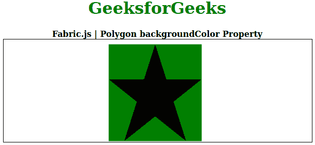

# 织物. js 多边形背景颜色属性

> 原文:[https://www . geesforgeks . org/fabric-js-polygon-background color-property/](https://www.geeksforgeeks.org/fabric-js-polygon-backgroundcolor-property/)

在这篇文章中，我们将看到如何使用 FabricJS 绘制一个填充颜色的画布多边形。画布多边形是指多边形是可移动的，可以根据需要拉伸。此外，当涉及到初始笔画颜色、高度、宽度或笔画宽度时，可以自定义多边形。

**方法:**为了实现这一点，我们将使用一个名为 FabricJS 的 JavaScript 库。导入库之后，我们将在主体标签中创建一个包含多边形的画布块。之后，我们将初始化由 FabricJS 提供的 canvas 和多边形的实例，并使用 **backgroundColor** 属性启用 Canvas 多边形的 **backgroundColor** ，并在 Canvas 上渲染多边形，如下所示。

**语法:**

```
fabric.Polygon([
   { x: pixel, y: pixel },
   { x: pixel, y: pixel },
   { x: pixel, y: pixel},
   { x: pixel, y: pixel},
   { x: pixel, y: pixel }],
   {
    backgroundColor: 'string'
   });

```

**参数:**该函数接受如上所述的单个参数，如下所述:

*   **背景色:**此参数定义多边形的背景色。

**注意:**尺寸像素是必须创建的多边形。

以下示例说明了结构。JavaScript 中的 JS 多边形 **backgroundColor** 属性:

**示例:**

## 超文本标记语言

```
<!DOCTYPE html>
<html>

<head>
    <!-- Loading the FabricJS library -->
    <script src=
"https://cdnjs.cloudflare.com/ajax/libs/fabric.js/3.6.2/fabric.min.js">
    </script>
</head>

<body>
    <div style="text-align: center;width: 600px;">
        <h1 style="color: green;">
            GeeksforGeeks
        </h1>
        <b>
            Fabric.js | Polygon backgroundColor Property
        </b>
    </div>
    <canvas id="canvas" width="600" height="200" 
        style="border:1px solid #000000;">
    </canvas>

    <script>
        // Initiate a Canvas instance 
        var canvas = new fabric.Canvas("canvas");

        // Initiate a polygon instance 
        var polygon = new fabric.Polygon([
            { x: 295, y: 10 },
            { x: 235, y: 198 },
            { x: 385, y: 78 },
            { x: 205, y: 78 },
            { x: 355, y: 198 }], {
            backgroundColor: 'green'
        });

        // Render the polygon in canvas 
        canvas.add(polygon); 
    </script>
</body>

</html>
```

**输出:**

