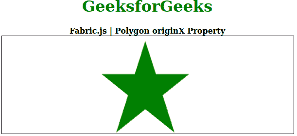

# 织物. js 多边形原点属性

> 原文:[https://www . geesforgeks . org/fabric-js-polygon-originx-property/](https://www.geeksforgeeks.org/fabric-js-polygon-originx-property/)

在本文中，我们将看到如何使用 **FabricJS** 设置对象画布多边形变换的水平原点。画布多边形是指多边形是可移动的，可以根据需要拉伸。此外，当涉及到初始笔画颜色、高度、宽度、填充颜色或笔画宽度时，可以自定义多边形。

为了实现这一点，我们将使用一个名为 **FabricJS** 的 JavaScript 库。导入库之后，我们将在主体标签中创建一个包含多边形的画布块。之后，我们将初始化由 FabricJS 提供的 Canvas 和多边形的实例，并使用 **originX** 属性设置多边形的水平变换，并在 Canvas 上渲染多边形，如下例所示。

**语法:**

```
fabric.Triangle([ 
    { x: pixel, y: pixel }, 
    { x: pixel, y: pixel }, 
    { x: pixel, y: pixel}, 
    { x: pixel, y: pixel}, 
    { x: pixel, y: pixel }],
    {
        originX: string
    });

```

**参数:**该属性接受如上所述的单个参数，如下所述:

*   **originX:** 指定画布多边形的水平变换。

**注意:**创建多边形必须要有尺寸像素。

下面的例子说明了织物。JavaScript 中的 JS 多边形 originX 属性:

**示例:**

## 超文本标记语言

```
<!DOCTYPE html>
<html>

<head>
    <!-- Loading the FabricJS library -->
    <script src=
"https://cdnjs.cloudflare.com/ajax/libs/fabric.js/3.6.2/fabric.min.js">
    </script>
</head>

<body>
    <div style="text-align: center;width: 600px;">
        <h1 style="color: green;">
            GeeksforGeeks
        </h1>
        <b>
            Fabric.js | Polygon originX Property
        </b>
    </div>
    <canvas id="canvas" width="600" height="200" 
        style="border:1px solid #000000;">
    </canvas>

    <script>

        // Initiate a Canvas instance 
        var canvas = new fabric.Canvas("canvas");

        // Initiate a polygon instance 
        var polygon = new fabric.Polygon([
            { x: 295, y: 10 },
            { x: 235, y: 198 },
            { x: 385, y: 78 },
            { x: 205, y: 78 },
            { x: 355, y: 198 }], {
            fill: 'green',
            originX: 'center'
        });

        // Render the polygon in canvas 
        canvas.add(polygon); 
    </script>
</body>

</html>
```

**输出:**

