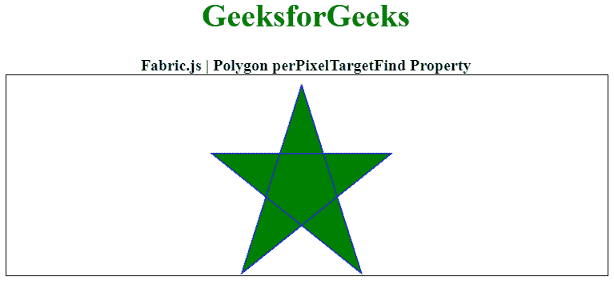

# Fabric.js 多边形 perPixelTargetFind 属性

> 原文:[https://www . geesforgeks . org/fabric-js-polygon-perpixel targetfind-property/](https://www.geeksforgeeks.org/fabric-js-polygon-perpixeltargetfind-property/)

在本文中，我们将看到使用 FabricJS 的多边形画布的 perPixelTargetFind 属性。画布多边形意味着多边形是可移动的，可以根据需要拉伸。此外，当涉及到初始笔画颜色、高度、宽度、填充颜色或笔画宽度时，可以自定义多边形。

为了实现这一点，我们将使用一个名为 FabricJS 的 JavaScript 库。导入库之后，我们将在主体标签中创建一个包含多边形的画布块。之后，我们将初始化由 FabricJS 提供的 canvas 和多边形的实例，并使用 perpixelltargetfind 属性设置 Canvas 多边形的 perpixelltargetfind，并在 Canvas 上渲染多边形，如下例所示。

**语法:**

```
fabric.Polygon([
    { x: pixel, y: pixel },
    { x: pixel, y: pixel },
    { x: pixel, y: pixel},
    { x: pixel, y: pixel},
    { x: pixel, y: pixel }
],
{
    perPixelTargetFind: Boolean
});
```

**参数:**该属性接受如上所述的单个参数，如下所述:

*   **perPixelTargetFind:** 当设置为‘true’时，对象是在画布上按像素“找到”的，而不是根据边界框。

下面的例子说明了织物。JavaScript 中的多边形像素目标查找:

**示例:**

## 超文本标记语言

```
<!DOCTYPE html> 
<html> 

<head> 
  <!-- Loading the FabricJS library -->
  <script src= 
"https://cdnjs.cloudflare.com/ajax/libs/fabric.js/3.6.2/fabric.min.js"> 
  </script> 
</head> 

<body> 
  <div style="text-align: center;width: 600px;"> 
    <h1 style="color: green;"> 
        GeeksforGeeks 
    </h1> 
    <b> 
        Fabric.js | Polygon perPixelTargetFind Property 
    </b> 
  </div> 
  <canvas id="canvas" width="600" height="200"
      style="border:1px solid #000000;"> 
  </canvas> 

  <script> 
    // Initiate a Canvas instance 
    var canvas = new fabric.Canvas("canvas"); 

    // Initiate a polygon instance 
    var polygon = new fabric.Polygon([ 
        { x: 295, y: 10 }, 
        { x: 235, y: 198 }, 
        { x: 385, y: 78 }, 
        { x: 205, y: 78 }, 
        { x: 355, y: 198 }], {
            fill:'green',
            stroke: 'blue',
         paintFirst: 'fill',
         perPixelTargetFind: 'true'

    }); 

    // Render the polygon in canvas 
    canvas.add(polygon); 
  </script> 
</body> 

</html>
```

**输出:**

