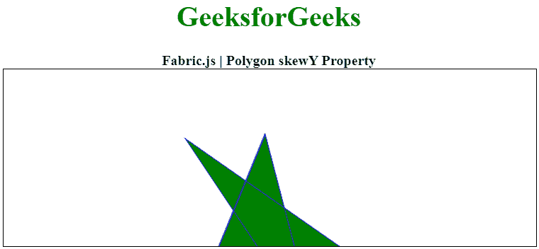

# Fabric.js 多边形倾斜属性

> 原文:[https://www . geesforgeks . org/fabric-js-polygon-skew y-property/](https://www.geeksforgeeks.org/fabric-js-polygon-skewy-property/)

在本文中，我们将看到如何使用 FabricJS 设置画布多边形的垂直倾斜。画布多边形意味着多边形是可移动的，可以根据需要拉伸。此外，多边形可以在初始笔画颜色、高度、宽度、填充颜色或笔画宽度方面进行自定义。

为了实现这一点，我们将使用一个名为 FabricJS 的 JavaScript 库。导入库之后，我们将在包含多边形的主体标签中创建一个画布块。之后，我们将初始化由 FabricJS 提供的 Canvas 和 Polygon 的实例，并使用 skewY 属性设置 Polygon 的垂直倾斜，并在 Canvas 上渲染 Polygon，如下例所示。

**语法:**

```
fabric.Polygon([
   { x: pixel, y: pixel },
   { x: pixel, y: pixel },
   { x: pixel, y: pixel},
   { x: pixel, y: pixel},
   { x: pixel, y: pixel }
],
{
   skewY : number
});
```

**参数:**该属性接受如上所述的单个参数，如下所述:

*   **偏斜:**指定垂直偏斜。

下面的例子说明了织物。JavaScript 中的多边形倾斜:

**示例:**

## 超文本标记语言

```
<!DOCTYPE html> 
<html> 

<head>
    <!-- Loading the FabricJS library -->
  <script src= 
"https://cdnjs.cloudflare.com/ajax/libs/fabric.js/3.6.2/fabric.min.js"> 
  </script> 
</head> 

<body> 
    <div style="text-align: center;width: 600px;"> 
      <h1 style="color: green;"> 
          GeeksforGeeks 
      </h1> 
      <b> 
          Fabric.js | Polygon skewY Property 
      </b> 
    </div>

    <canvas id="canvas" width="600" height="200"
        style="border:1px solid #000000;"> 
    </canvas> 

    <script> 
        // Initiate a Canvas instance 
        var canvas = new fabric.Canvas("canvas"); 

        // Initiate a polygon instance 
        var polygon = new fabric.Polygon([ 
            { x: 295, y: 10 }, 
            { x: 235, y: 198 }, 
            { x: 385, y: 78 }, 
            { x: 205, y: 78 }, 
            { x: 355, y: 198 }], {
             fill:'green',
             stroke: 'blue',
             paintFirst: 'fill',
             skewY: 35
        }); 

        // Render the polygon in canvas 
        canvas.add(polygon); 
    </script> 
</body> 

</html>
```

**输出:**

