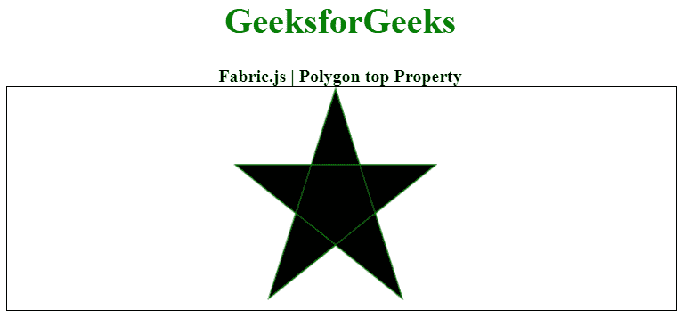

# 织物. js 多边形顶部属性

> 原文:[https://www . geesforgeks . org/fabric-js-polygon-top-property/](https://www.geeksforgeeks.org/fabric-js-polygon-top-property/)

在本文中，我们将看到如何使用 FabricJS 设置画布多边形的顶部，它用于填充一个对象。画布多边形意味着多边形是可移动的，可以根据需要拉伸。此外，当涉及到初始笔画颜色、高度、宽度、填充颜色或笔画宽度时，可以自定义多边形。

为了实现这一点，我们将使用一个名为 FabricJS 的 JavaScript 库。导入库之后，我们将在主体标签中创建一个包含多边形的画布块。之后，我们将初始化由 FabricJS 提供的 canvas 和多边形的实例，并使用 top 属性设置 Canvas 三角形的顶部颜色，并在 Canvas 上渲染多边形，如下例所示。

**语法:**

```
fabric.Polygon([  
       { x: pixel, y: pixel },  
       { x: pixel, y: pixel },  
       { x: pixel, y: pixel},  
       { x: pixel, y: pixel},  
       { x: pixel, y: pixel }],
       {
               top: number
       });
```

**参数:**该属性接受如上所述的单个参数，如下所述:

*   **顶部:**物体的顶部位置。请注意，默认情况下，它相对于对象顶部。您可以通过设置 originY = {顶部/中心/底部}来更改此设置

**注意:**尺寸像素是必须创建的多边形。

下面的例子说明了织物。JavaScript 中的 JS 多边形顶部:

**示例:**

## 超文本标记语言

```
<!DOCTYPE html> 
<html> 

<head> 
    <!-- Loading the FabricJS library -->
    <script src= 
"https://cdnjs.cloudflare.com/ajax/libs/fabric.js/3.6.2/fabric.min.js"> 
    </script> 
</head> 

<body> 
        <div style="text-align: center;width: 600px;"> 
        <h1 style="color: green;"> 
            GeeksforGeeks 
        </h1> 
        <b> 
            Fabric.js | Polygon top Property 
        </b> 
        </div> 
    <canvas id="canvas"
            width="600"
            height="200"
            style="border:1px solid #000000;"> 
    </canvas> 

    <script> 

        // Initiate a Canvas instance 
        var canvas = new fabric.Canvas("canvas"); 

        // Initiate a polygon instance 
        var polygon = new fabric.Polygon([ 
        { x: 295, y: 10 }, 
        { x: 235, y: 198 }, 
        { x: 385, y: 78}, 
        { x: 205, y: 78}, 
        { x: 355, y: 198 }], { 
            stroke: 'green', 
            top: 1
        }); 

        // Render the polygon in canvas 
        canvas.add(polygon); 
    </script> 
</body> 

</html>
```

**输出:**

