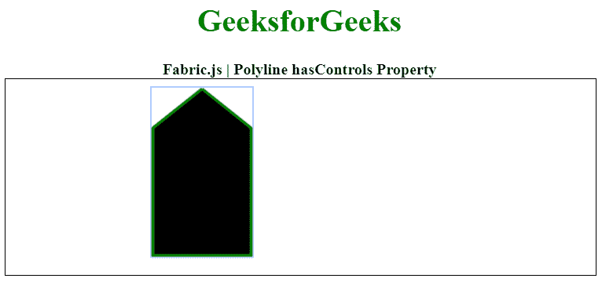

# Fabric.js 折线具有控件属性

> 原文:[https://www . geesforgeks . org/fabric-js-polyline-has controls-property/](https://www.geeksforgeeks.org/fabric-js-polyline-hascontrols-property/)

在本文中，我们将看到如何使用 FabricJS 设置画布折线的控件。画布三角形意味着折线是可移动的，可以根据需要拉伸。此外，在初始描边颜色、高度、宽度、填充颜色或描边宽度方面，可以自定义折线。

**方法:**为了实现这一点，我们将使用一个名为 FabricJS 的 JavaScript 库。导入库后，我们将在包含折线的主体标记中创建一个画布块。之后，我们将初始化 FabricJS 提供的画布和折线实例，并使用 hasControls 属性设置画布折线的控件，并在画布上渲染折线，如下例所示。

**语法:**

```
var polyline = new fabric.Polyline(Points, {  
    hasControls: boolean
});  
```

**参数:**该属性接受如上所述的单个参数，如下所述:

*   **有控制:**指定是否启用控制。

下面的例子说明了 Fabric.js 中的 cornerStyle 属性:

**示例:**

## 超文本标记语言

```
<!DOCTYPE html> 
<html>

<head> 

  <!-- Loading the FabricJS library -->
  <script src= 
"https://cdnjs.cloudflare.com/ajax/libs/fabric.js/3.6.2/fabric.min.js"> 
  </script> 
</head> 

<body> 
  <div style="text-align: center;width: 600px;"> 
    <h1 style="color: green;"> 
        GeeksforGeeks 
    </h1> 
    <b> 
        Fabric.js | Polyline hasControls Property 
    </b> 
  </div>

  <canvas id="canvas"
        width="600"
        height="200"
        style="border:1px solid #000000;"> 
  </canvas> 

  <script> 

    // Initiate a Canvas instance 
    var canvas = new fabric.Canvas("canvas"); 

    // Initiate a polyline instance 
    var polyline = new fabric.Polyline([ 
    {x: 200, y: 10 }, 
    {x: 250,  y: 50 },
    {x: 250, y: 180 }, 
    {x: 150, y: 180 }, 
    {x: 150, y: 50 },
    { x: 200, y: 10 }], { 
      stroke: 'green',  
      strokeWidth: 3,  
      cornerStyle: 'circle',  
      hasControls: false,
    }); 

    // Render the polyline in canvas 
    canvas.add(polyline); 
  </script> 
</body> 

</html>
```

**输出:**

