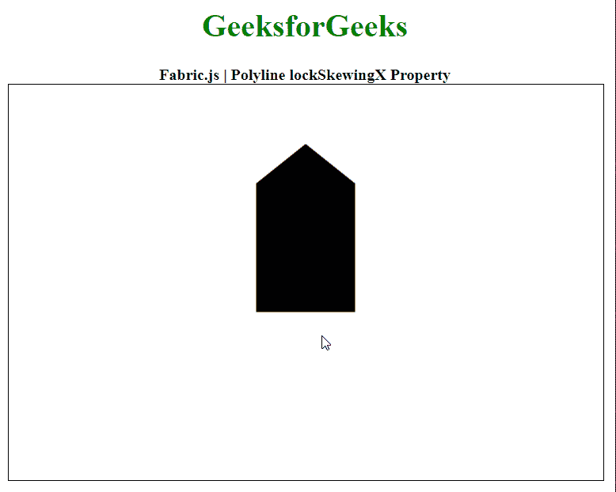

# Fabric.js 折线 lockSkewingX 属性

> 原文:[https://www . geesforgeks . org/fabric-js-polyline-lockskewingx-property/](https://www.geeksforgeeks.org/fabric-js-polyline-lockskewingx-property/)

在本文中，我们将看到如何使用 Fabric.js 锁定画布折线的水平倾斜。Fabric.js 中的折线是可移动的，并且可以根据 g 到要求进行拉伸。此外，当涉及到初始笔画颜色、高度、宽度、填充颜色或笔画宽度时，可以自定义折线。

为了实现这一点，我们将使用一个名为 Fabric.js 的 JavaScript 库。导入库后，我们将在主体标签中创建一个包含折线的画布块。之后，我们将初始化 Fabric.js 提供的 Canvas 和 Polyline 的实例，设置是否使用 lockSkewingX 属性锁定折线的水平倾斜，并在 Canvas 上渲染折线，如下例所示。

**语法:**

```
var polyline = new fabric.Polyline(Points, {  
    lockSkewingX: Boolean
});  
```

**参数:**该属性接受如上所述的单个参数，如下所述:

*   **lockSkewingX:** 是一个布尔值，指定是否锁定画布的水平倾斜。

下面的例子说明了 Fabric.js 中的 lockSkewingX 属性:

**示例:**

## 超文本标记语言

```
<!DOCTYPE html>
<html>

<head>
    <!-- Loading the FabricJS library -->
    <script src=
"https://cdnjs.cloudflare.com/ajax/libs/fabric.js/3.6.2/fabric.min.js">
    </script>
</head>

<body>
    <div style="text-align: center;width: 600px;">
        <h1 style="color: green;">
            GeeksforGeeks
        </h1>

        <b>
            Fabric.js | Polyline lockSkewingX Property
        </b>
    </div>

    <canvas id="canvas" width="600" height="400" 
        style="border:1px solid #000000;">
    </canvas>

    <script>

        // Initiate a Canvas instance 
        var canvas = new fabric.Canvas("canvas");

        // Initiate a Polyline instance  
        var polyline = new fabric.Polyline([{
            x: 300,
            y: 60
        }, {
            x: 350,
            y: 100
        }, {
            x: 350,
            y: 230
        }, {
            x: 250,
            y: 230
        }, {
            x: 250,
            y: 100
        }, {
            x: 300,
            y: 60
        }], {

            // Disable skewing 
            // along the x-axis 
            lockSkewingX: true
        });

        // Render the polyline in canvas 
        canvas.add(polyline);
    </script>
</body>

</html>
```

**输出:**

