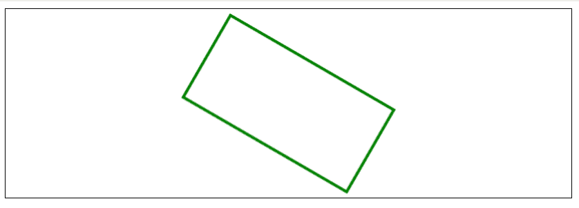

# 织物|直角属性

> 原文:[https://www . geesforgeks . org/fabric-js-rect-angle-property/](https://www.geeksforgeeks.org/fabric-js-rect-angle-property/)

在本文中，我们将看到如何使用 FabricJS 设置画布矩形中对象的旋转角度。画布矩形意味着矩形是可移动的，可以根据需要拉伸。此外，当涉及到初始笔画颜色、高度、宽度、填充颜色或笔画宽度时，可以定制矩形。

**方法:**为了使其成为可能，我们将使用一个名为 FabricJS 的 JavaScript 库。使用 CDN 导入库后，我们将在主体标签中创建一个画布块，其中将包含我们的矩形。之后，我们将初始化 FabricJS 提供的 Canvas 和 Rectangle 的实例，并使用 angle 属性将文本旋转到所需的角度，并在矩形上呈现 Canvas，如下例所示。

**语法:**

```
fabric.Rect({
    width: number,
    height: number,
    angle: number
}); 
```

**参数:**该功能接受三个参数，如上所述，描述如下:

*   **宽度:**指定矩形的宽度。
*   **高度:**指定矩形的高度。
*   **角度:**指定旋转角度。

**示例:**本示例使用 FabricJS 创建一个矩形并使其可旋转。

```
<!DOCTYPE html> 
<html> 

<head> 
    <title> 
        Fabric.js | Rect angle Property
    </title> 

    <!-- Adding the FabricJS library -->
    <script src= 
"https://cdnjs.cloudflare.com/ajax/libs/fabric.js/3.6.2/fabric.min.js"> 
    </script> 
</head> 

<body> 
    <canvas id="canvas" width="600" height="200"
        style="border:1px solid #000000"> 
    </canvas> 

    <script> 

        // Initiate a Canvas instance 
        var canvas = new fabric.Canvas("canvas"); 

        // Initiate a Rect instance 
        var rectangle = new fabric.Rect({ 
            width: 200,
            height: 100,
            fill: '', 
            stroke: 'green', 
            strokeWidth: 3,
            angle: 30
        }); 

        // Render the Rect in canvas 
        canvas.add(rectangle); 
        canvas.centerObject(rectangle);
    </script> 
</body> 

</html>
```

**输出:**
