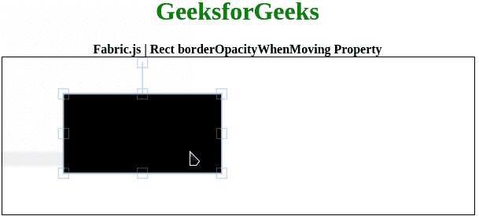

# 移动属性时的矩形边界

> 原文:[https://www . geesforgeks . org/fabric-js-rect-borderopacitywhen moveing-property-2/](https://www.geeksforgeeks.org/fabric-js-rect-borderopacitywhenmoving-property-2/)

在本文中，我们将看到如何使用 FabricJS 设置画布矩形的移动边框不透明度。画布意味着矩形是可移动的，可以根据需要拉伸。此外，当涉及到初始笔画颜色、填充颜色、笔画宽度或大小时，可以定制矩形。
为了实现这一点，我们将使用一个名为 FabricJS 的 JavaScript 库。使用 CDN 导入库后，我们将在主体标签中创建一个包含矩形的**画布**块。之后，我们将初始化由 FabricJS 提供的 canvas 和 Rect 的实例，并使用**borderropacitywharting**属性设置 Canvas 矩形的移动边框不透明度，并在 Canvas 上渲染 Rect，如下例所示。
**语法:**

```
fabric.Rect({
    width: number,
    height: number,
    borderOpacityWhenMoving: number
}); 
```

**参数:**该功能接受三个参数，如上所述，描述如下:

*   **宽度:**指定水平长度。
*   **高度:**指定垂直长度。
*   **移动时的边框透明度:**指定移动时的边框透明度。

**示例:**本示例使用 FabricJS 设置画布矩形的移动边框不透明度。请注意，您必须移动对象才能看到移动的边框不透明度。

## 超文本标记语言

```
<!DOCTYPE html>
<html>

<head>
    <title>
        Fabric.js | Rect borderOpacityWhenMoving Property
    </title>

    <!-- FabricJS CDN -->
    <script src=
"https://cdnjs.cloudflare.com/ajax/libs/fabric.js/3.6.2/fabric.min.js">
    </script>
</head>

<body>
    <div style="text-align: center;width: 600px;">
        <h1 style="color: green;">
            GeeksforGeeks
        </h1>
        <b>
            Fabric.js | Rect borderOpacityWhenMoving Property
        </b>
    </div>

    <div style="text-align: center;">
    <canvas id="canvas" width="600" height="200"
            style="border:1px solid #000000;">
    </canvas>
    </div>

    <script>
        // Initiate a Canvas instance
        var canvas = new fabric.Canvas("canvas");

        // Initiate a Rect instance
        var rect = new fabric.Rect({
            width: 200,
            height: 100,
            borderOpacityWhenMoving: 0
        });

        // Render the rectangle in canvas
        canvas.add(rect);
    </script>
</body>

</html>                  
```

**输出:**

