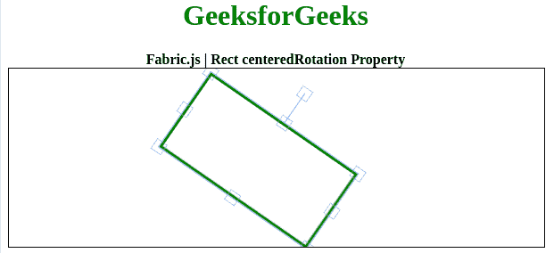

# 织物|矩形中心站属性

> 原文:[https://www . geeksforgeeks . org/fabric-js-rect-centereprotation-property/](https://www.geeksforgeeks.org/fabric-js-rect-centeredrotation-property/)

在本文中，我们将看到如何使用 FabricJS 禁用画布矩形的居中旋转。画布矩形意味着矩形是可移动的，可以根据需要拉伸。此外，当涉及到初始笔画颜色、高度、宽度、填充颜色或笔画宽度时，可以定制矩形。

为了实现这一点，我们将使用一个名为 FabricJS 的 JavaScript 库。导入库之后，我们将在主体标签中创建一个包含矩形的画布块。在此之后，我们将初始化由 FabricJS 提供的 canvas 和 Rect 的实例，并使用**centeredecoration**属性禁用 Canvas 矩形的居中旋转，并在 Canvas 上渲染 Rect，如下例所示。

**语法:**

```
fabric.Rect({
    width: number,
    height: number,
    centeredRotation: boolean
}); 
```

**参数:**该函数接受三个参数，如上所述，如下所述:

*   **宽度:**此参数定义矩形的宽度。
*   **高度:**此参数定义矩形的高度。
*   **居中旋转:**此参数定义是启用还是禁用居中旋转。

**示例:**本示例使用 FabricJS 禁用画布状矩形的居中旋转，如下所示。尝试在禁用居中旋转后旋转对象，它将使用左上角作为旋转中心。

```
<!DOCTYPE html> 
<html> 

<head> 
    <title> 
        Fabric.js | Rect centeredRotation Property
    </title> 

    <!-- Adding the FabricJS library -->
    <script src= 
"https://cdnjs.cloudflare.com/ajax/libs/fabric.js/3.6.2/fabric.min.js"> 
    </script> 
</head> 

<body> 
    <div style="text-align: center;width: 600px;">
          <h1 style="color: green;">
              GeeksforGeeks
          </h1>
          <b>
            Fabric.js | Rect centeredRotation Property
          </b>
    </div>
    <canvas id="canvas" width="600" height="200"
        style="border:1px solid #000000"> 
    </canvas> 

    <script> 

        // Initiate a Canvas instance 
        var canvas = new fabric.Canvas("canvas"); 

        // Initiate a Rect instance 
        var rectangle = new fabric.Rect({ 
            width: 200,
            height: 100,
            fill: '', 
            stroke: 'green',
            strokeWidth: 3,
            centeredRotation: true
        }); 

        // Render the Rect in canvas 
        canvas.add(rectangle); 
        canvas.centerObject(rectangle);
    </script> 
</body> 

</html>
```

**输出:**
