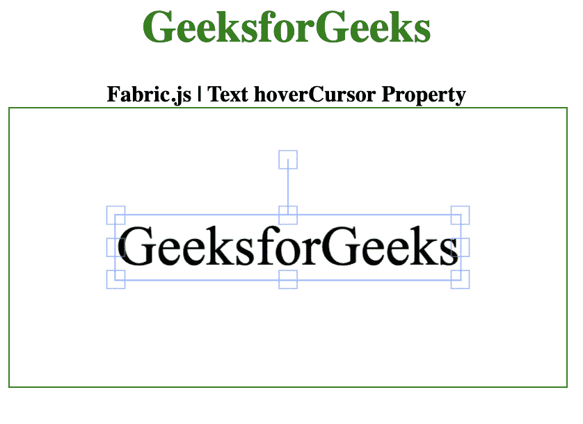

# Fabric.js 文本悬停光标属性

> 原文:[https://www . geesforgeks . org/fabric-js-text-悬停光标-property/](https://www.geeksforgeeks.org/fabric-js-text-hovercursor-property/)

在本文中，我们将看到如何使用 Fabric.js 使用文本画布的悬停光标属性。画布意味着所写的文本是可移动的、可旋转的、可调整大小的，并且可以拉伸。此外，文本本身不能像文本框一样编辑。
为了使其成为可能，我们将使用一个名为 Fabric.js 的 JavaScript 库，在使用 CDN 导入库之后，我们将在 body 标签中创建一个画布块，其中将包含我们的文本。之后，我们将初始化由 FabricJS 提供的 canvas 和 Text 的实例，并设置 Canvas 的悬停光标属性。

**语法**

```
 fabric.Text(text,
    hoverCursor : pointer
 ); 
```

**参数:**该属性接受一个参数，如上所述，如下所述:

*   **悬停光标:**是字符串值。

## 超文本标记语言

```
<!DOCTYPE html>
<html>

  <head>
    <!-- Loading the FabricJS library -->
    <script src=
"https://cdnjs.cloudflare.com/ajax/libs/fabric.js/3.6.2/fabric.min.js">
    </script>
  </head>

  <body>
    <div style="text-align: center;width: 400px;">
      <h1 style="color: green;">
        GeeksforGeeks
      </h1>
      <b>
        Fabric.js | Text hoverCursor Property
      </b>
    </div>

    <div style="text-align: center;">
      <canvas id="canvas" width="400" height="200"
              style="border:1px solid green;">
      </canvas>
    </div>

    <script>
      // Create a new instance of Canvas
      var canvas = new fabric.Canvas("canvas");

      // Create a new Text instance
      var geek = new fabric.Text('GeeksforGeeks', {
        hoverCursor : 'pointer' 
      });

      // Render the text on Canvas
      canvas.add(geek);
      canvas.centerObject(geek);
    </script>
  </body>

</html>
```

**输出:**



**参考:**T2http://fabricjs.com/docs/fabric.Object.html#hoverCursor