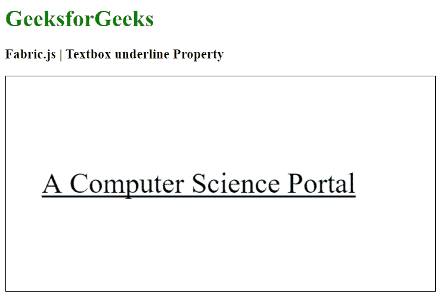

# Fabric.js 文本框下划线属性

> 原文:[https://www . geesforgeks . org/fabric-js-textbox-underline-property/](https://www.geeksforgeeks.org/fabric-js-textbox-underline-property/)

在本文中，我们将看到如何使用 FabricJS 的下划线属性向类似画布的文本框添加下划线。画布意味着所写的文本框是可移动的、可旋转的、可调整大小的，并且可以拉伸。但是在本文中，我们将在文本框中添加下划线。此外，文本本身不能像文本框一样编辑。

**方法:**为了实现这一点，我们将使用一个名为 FabricJS 的 JavaScript 库。使用 CDN 导入库后，我们将在主体标签中创建一个画布块，其中将包含我们的文本框。之后，我们将初始化 FabricJS 提供的 Canvas 和 Textbox 的实例，并使用下划线属性为文本添加下划线，并在 Textbox 上呈现 Canvas，如下例所示。

**语法:**

```
fabric.Textbox('text', {
    underline: boolean
});
```

**参数:**该函数接受一个参数，如上所述，如下所述:

*   **下划线:**指定是否加下划线。

**示例:**该示例使用 FabricJS 文本框下划线属性为画布文本框添加下划线，如下所示。

## 超文本标记语言

```
<!DOCTYPE html>
<html>

<head>
    <!-- Adding the FabricJS library -->
    <script src=
"https://cdnjs.cloudflare.com/ajax/libs/fabric.js/3.6.2/fabric.min.js">
    </script>
</head>

<body>
    <h1 style="color: green;">
        GeeksforGeeks
    </h1>

    <h3>
        Fabric.js | Textbox underline Property
    </h3>

    <canvas id="canvas" width="600" height="300"
        style="border:1px solid #000000">
    </canvas>

    <script>

        // Initiate a Canvas instance 
        var canvas = new fabric.Canvas("canvas");

        // Create a new Textbox instance 
        var text = new fabric.Textbox(
            'A Computer Science Portal', {
            width: 500,
            underline: true
        });

        // Render the Textbox in canvas 
        canvas.add(text);
        canvas.centerObject(text);
    </script>
</body>

</html>
```

**输出:**

