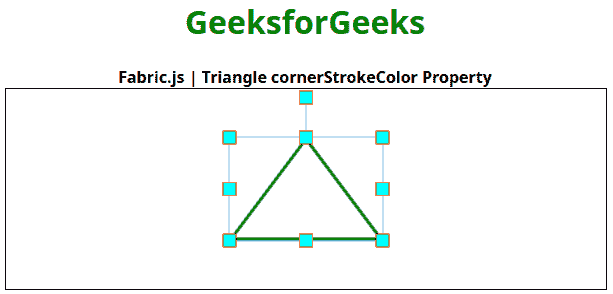

# Fabric.js |三角形转角颜色属性

> 原文:[https://www . geesforgeks . org/fabric-js-triangle-cornerstrokecolor-property/](https://www.geeksforgeeks.org/fabric-js-triangle-cornerstrokecolor-property/)

在本文中，我们将看到如何使用 **FabricJS** 设置画布三角形控制角的颜色。画布三角形是指三角形是可移动的，可以根据需要拉伸。此外，当涉及到初始笔画颜色、高度、宽度、填充颜色或笔画宽度时，可以自定义三角形。
为了实现这一点，我们将使用一个名为**fabrijs**的 JavaScript 库。导入库后，我们将在主体标签中创建一个包含三角形的画布块。之后，我们将初始化 **FabricJS** 提供的画布和三角形的实例，并使用 **cornerStrokeColor** 属性设置画布三角形的控制角的颜色，并在画布上渲染三角形，如下例所示。
**语法:**

```
fabric.Triangle({
    width: number,
    height: number,
    cornerStrokeColor: string,
    transparentCorner: boolean
});
```

**参数:**该功能接受四个参数，如上所述，描述如下:

*   **宽度:**指定三角形的宽度。
*   **高度:**指定三角形的高度。
*   **角笔画颜色:**指定控制角的笔画颜色。
*   **透明角:**指定控制角是否可见。

**示例:**本示例使用 **FabricJS** 设置画布状三角形控制角的笔画颜色，如下所示。你必须点击对象才能看到控制角的笔画颜色。

## 超文本标记语言

```
<!DOCTYPE html>
<html>

<head>
    <title>
        Fabric.js | Triangle cornerStrokeColor Property
    </title>

    <!-- Adding the FabricJS library -->
    <script src=
"https://cdnjs.cloudflare.com/ajax/libs/fabric.js/3.6.2/fabric.min.js">
    </script>
</head>

<body>
        <div style="text-align: center;width: 600px;">
        <h1 style="color: green;">
            GeeksforGeeks
        </h1>
        <b>
            Fabric.js | Triangle cornerStrokeColor Property
        </b>
        </div>
    <canvas id="canvas" width="600" height="200"
        style="border:1px solid #000000">
    </canvas>

    <script>

        // Initiate a Canvas instance
        var canvas = new fabric.Canvas("canvas");

        // Initiate a triangle instance
        var triangle = new fabric.Triangle({
                        width: 150,
                        height: 100,
                        fill: '',
                        stroke: 'green',
                        strokeWidth: 3,
                        cornerColor: 'cyan',
                        cornerStrokeColor: 'red',
                        transparentCorners: false
        });

        // Render the triangle in canvas
        canvas.add(triangle);
        canvas.centerObject(triangle);
    </script>
</body>

</html>                   
```

**输出:**

