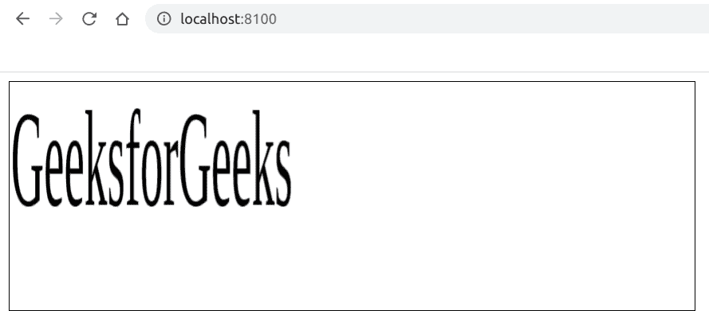

# 如何使用 Fabric.js 给文本画布添加默认垂直缩放？

> 原文:[https://www . geesforgeks . org/how-add-default-vertical-scaling-to-a-text-canvas-use-fabric-js/](https://www.geeksforgeeks.org/how-to-add-default-vertical-scaling-to-a-text-canvas-using-fabric-js/)

在本文中，我们将看到如何使用 FabricJS 向文本画布添加默认的垂直缩放。画布意味着书写的文本是可移动、可旋转、可调整大小和可拉伸的。但是在本文中，我们将添加默认的垂直缩放。此外，文本本身不能像文本框一样编辑。

**方法:**为了使其成为可能，我们将使用一个名为 FabricJS 的 JavaScript 库。使用 CDN 导入库后，我们将在主体标签中创建一个包含文本的*画布*块。在此之后，我们将初始化由 FabricJS 提供的 Canvas 和 Text 的实例，并使用 **scaleY** 属性添加默认的垂直缩放，并在 Text 上渲染 Canvas，如下例所示。

**语法:**

```
 fabric.Text(text, scaleY: number); 
```

**参数:**该函数接受两个参数，如上所述，如下所述:

*   **文本:**指定要写入的文本。
*   **缩放:**指定默认垂直缩放。

**程序:**我们可以使用 FabricJS 为画布状的文本添加默认的垂直缩放，如下所示。

```
<!DOCTYPE html>
<html>

<head>
    <title>
        How to add default vertical scaling
        to a text canvas using Fabric.js?
    </title>

    <!-- Loading the FabricJS library -->
    <script src=
"https://cdnjs.cloudflare.com/ajax/libs/fabric.js/3.6.2/fabric.min.js">
    </script>
</head>

<body>
    <canvas id="canvas" width="600" height="200" 
        style="border:1px solid #000000;">
    </canvas>

    <script>

        // Create a new instace of Canvas
        var canvas = new fabric.Canvas("canvas");

        // Create a new Text instance
        var text = new fabric.Text('GeeksforGeeks', {
            scaleY: 3
        });

        // Render the text on Canvas
        canvas.add(text);
    </script>
</body>

</html>
```

**输出:**
