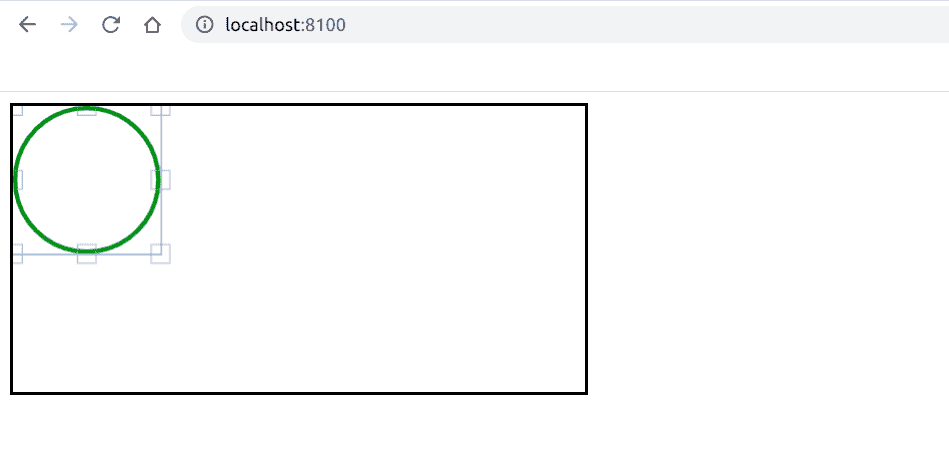

# 如何使用 Fabric.js 创建画布圆？

> 原文:[https://www . geesforgeks . org/how-to-create-a-canvas-circle-use-fabric-js/](https://www.geeksforgeeks.org/how-to-create-a-canvas-circle-using-fabric-js/)

在本文中，我们将看到如何使用 FabricJS 创建一个画布圆。画布意味着圆是可移动的，可以根据需要拉伸。此外，当涉及到初始笔画颜色、填充颜色、笔画宽度或半径时，可以对圆进行自定义。

**方法:**为了实现这一点，我们将使用一个名为 FabricJS 的 JavaScript 库。使用 CDN 导入库后，我们将在主体标签中创建一个包含我们的圆的*画布*块。之后，我们将初始化由 FabricJS 提供的 Canvas 和 Circle 的实例，并在 Canvas 上渲染 Circle，如下例所示。

**语法:**

```
fabric.Circle({
    radius: number,
    fill: string,
    stroke: string,
    strokeWidth: int
}); 
```

**参数:**该功能接受四个参数，如上所述，描述如下:

*   **半径:**指定圆的半径。
*   **填充:**指定填充颜色。
*   **笔画:**指定笔画颜色。
*   **笔画宽度:**指定笔画的宽度。

**示例:**本示例使用 FabricJS 创建简单的可编辑画布圆。

```
<!DOCTYPE html>
<html>

<head>
    <!-- FabricJS CDN -->
    <script src=
"https://cdnjs.cloudflare.com/ajax/libs/fabric.js/3.6.2/fabric.min.js">
    </script>
</head>

<body>
    <canvas id="canvas" width="400" height="200" 
        style="border:2px solid #000000">
     </canvas>

    <script>

        // Initiate a Canvas instance
        var canvas = new fabric.Canvas("canvas");

        // Initiate a Circle instance
        var circle = new fabric.Circle({
            radius: 50,
            fill: '',
            stroke: 'green',
            strokeWidth: 3
        });

        // Render the circle in canvas
        canvas.add(circle);
    </script>
</body>

</html>
```

**输出:**
