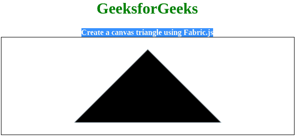

# 如何使用 Fabric.js 创建画布三角形？

> 原文:[https://www . geesforgeks . org/how-to-create-a-canvas-triangle-use-fabric-js/](https://www.geeksforgeeks.org/how-to-create-a-canvas-triangle-using-fabric-js/)

在本文中，我们将使用 **FabricJS** 创建一个画布三角形。画布三角形是指三角形是可移动的，可以根据需要拉伸。此外，当涉及到初始笔画颜色、高度、宽度、填充颜色或笔画宽度时，可以自定义三角形。

为了实现这一点，我们将使用一个名为 **FabricJS** 的 JavaScript 库。导入库后，我们将在主体标签中创建一个包含三角形的画布块。之后，我们将初始化由**法布里斯**提供的画布和三角形实例，并在画布实例上渲染三角形实例。

**语法:**

```
fabric.Triangle({
    width: number,
    height: number,
});
```

**参数:**该函数接受两个参数，如上所述，如下所述:

*   **宽度:**指定三角形的宽度。
*   **高度:**指定三角形的高度。

**示例:**本示例使用 FabricJS 创建简单的可编辑画布三角形。

```
<!DOCTYPE html> 
<html> 

<head> 
    <title> 
        How to create a canvas triangle using Fabric.js ?
    </title> 

    <!-- Adding the FabricJS library -->
    <script src= 
"https://cdnjs.cloudflare.com/ajax/libs/fabric.js/3.6.2/fabric.min.js"> 
    </script> 
</head> 

<body> 
    <div style="text-align: center;width: 600px;"> 
        <h1 style="color: green;"> 
          GeeksforGeeks 
        </h1> 
        <b> 
              Create a canvas triangle using Fabric.js  
        </b> 
    </div>
    <canvas id="canvas" width="600" height="200"
        style="border:1px solid #000000"> 
    </canvas> 

    <script> 

        // Initiate a Canvas instance 
        var canvas = new fabric.Canvas("canvas"); 

        // Initiate a triangle instance 
        var triangle = new fabric.Triangle({
            width: 300,
            height: 150
        });

        // Render the Triangle in canvas 
        canvas.add(triangle); 
        canvas.centerObject(triangle);
    </script> 
</body> 

</html>
```

**输出:**
