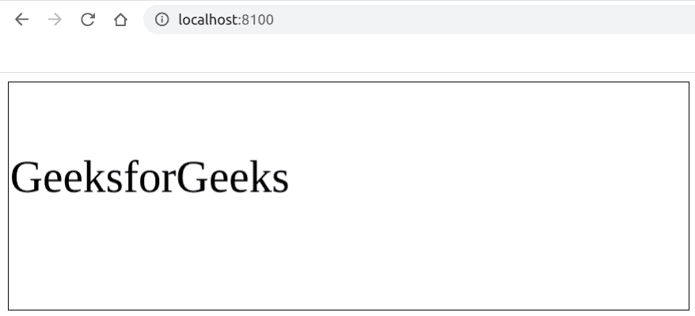

# 如何使用 Fabric.js 相对于文本画布顶部定位？

> 原文:[https://www . geesforgeks . org/如何相对于文本画布顶部定位-使用织物-js/](https://www.geeksforgeeks.org/how-to-position-relative-to-top-of-a-text-canvas-using-fabric-js/)

在本文中，我们将看到如何使用 FabricJS 相对于画布状文本的顶部进行定位。画布意味着书写的文本是可移动、可旋转、可调整大小和可拉伸的。但是在本文中，我们将相对于顶部进行定位。此外，文本本身不能像文本框一样编辑。
**方法:**为了实现这一点，我们将使用一个名为 FabricJS 的 JavaScript 库。使用 CDN 导入库后，我们将在主体标签中创建一个包含文本的*画布*块。之后，我们将初始化由 FabricJS 提供的 Canvas 和 Text 的实例，并使用 **top** 属性相对于顶部进行定位，并在 Text 上渲染 Canvas，如下例所示。

**语法:**

```
 fabric.text(text :string, top: number); 
```

**参数:**该函数接受两个参数，如上所述，如下所述:

*   **文本:**指定文本。
*   **顶部:**指定距顶部的距离。

**程序:**本示例使用 FabricJS 相对于画布状文本的顶部进行定位，如下所示。

## 超文本标记语言

```
<!DOCTYPE html>
<html>
<head>
    <title>
        How to position relative to top of
        canvas-like text using Fabric.js?
    </title>

    <!-- Loading the FabricJS library -->
    <script src=
"https://cdnjs.cloudflare.com/ajax/libs/fabric.js/3.6.2/fabric.min.js">
    </script>
</head>

<body>
    <canvas id="canvas" width="600" height="200"
        style="border:1px solid #000000;">
    </canvas>

    <script>

        // Create a new instance of Canvas
        var canvas = new fabric.Canvas("canvas");

       // Create a new Text instance
        var text = new fabric.Text('GeeksforGeeks', {
            top: 40
        });

        // Render the text on Canvas
        canvas.add(text);
  </script>
</body>

</html>
```

**输出:**

