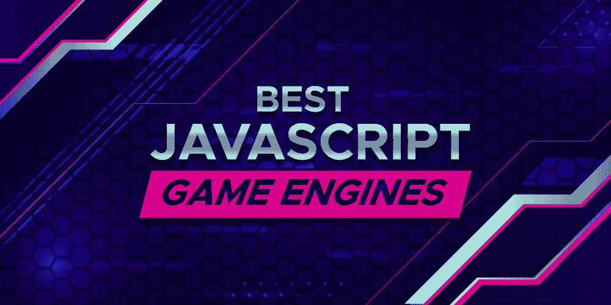

# 8 款最佳 Javascript 游戏引擎

> 原文:[https://www . geesforgeks . org/8-best-JavaScript-game-engines/](https://www.geeksforgeeks.org/8-best-javascript-game-engines/)

**JavaScript** 是一种跨平台、可解释的脚本语言。它以网页的开发而闻名。此外，许多非浏览器环境也使用它。JavaScript 可用于 [**<u>客户端</u>**](https://www.geeksforgeeks.org/server-side-client-side-programming/) 开发以及 [**<u>服务器端</u>**](https://www.geeksforgeeks.org/server-side-client-side-programming/) 开发。在本文中，我们将探索每个 JS 开发人员都应该知道的 8 大精选 JavaScript 游戏引擎。

### 1.PixiJS

PixiJS 是一个非常灵活且最快的 2D 渲染库。使用 PixiJS，您可以创建交互式的、视觉上令人愉悦的图形，它还支持跨平台应用程序。

Pixi 渲染器允许程序员利用硬件加速的能力，而无需事先了解 WebGL(它还支持画布回退)。然而，它没有内置的物理引擎。这是一个免费的开源图书馆，一个巨大的支持社区推动了它的发展。

### 2.相位器

Phaser 非常适合**跨平台**游戏应用的开发。令人惊讶的是，它在内部同时使用了一个 WebGL 和 Canvas(对于不支持 WebGL 的设备)渲染器，并且可以基于浏览器支持在它们之间自动交换。

Phaser 支持各种各样的插件，并得到了大量使用 Phaser 开发游戏的开发者的支持。目前，它是 GitHub 上最明星的游戏框架/引擎之一。JavaScript 或 TypeScript 可用于开发。

### 3.巴比伦。射流研究…

巴比伦 JS 是一个令人难以置信的强大，美丽和简单的渲染引擎。它让程序员能够在你的浏览器中创建几乎所有的东西，从动画标志到完全交互式的 **3D 游戏**。

虽然它不完全是一个游戏引擎渲染引擎，因为它是专门为可视化目的而制作的，但是你仍然可以用它来构建强大的游戏。由于其积极和乐于助人的开发人员，它拥有强大的社区支持。它配有一个操场，用于在开发前测试东西。

### 4.playcanvas webgl 游戏引擎

它使用 HTML5 和 WebGL 在任何移动或桌面浏览器中运行游戏应用程序和任何其他交互式 3D 内容，而不需要插件。这意味着你将使用他们的平台编写代码，测试代码，并通过一次点击导出游戏来设置场景。

它的主要焦点是游戏引擎，而不是渲染引擎，不像巴比伦 JS。通过使用 3D 刚体**物理引擎**弹药. js，物理可以非常容易地集成到你的游戏中。

### 5.Melon.js

这是一个非常初学者友好、重量轻、功能强大的 HTML5 游戏引擎，它集成了流行的平铺地图格式，使开发人员和设计人员能够专注于内容。它的主要重点是提供无插件的体验(除了支持 HTML5 的浏览器之外，它不依赖其他任何东西)。

它实现了轻量级物理，以确保低 CPU 需求。这是一个由热情的开发者组成的活跃社区支持的免费开源项目。

### 6.GDevelop

这是一个开源的，功能齐全的游戏开发软件，它的主要重点是 2D 游戏开发，但你可以用它来构建任何类型的游戏。

使其独特、简单、区别于其他游戏引擎的特点是 **Events，**它是一个不用任何特定编程语言知识就能直观构建游戏逻辑的工具。GDevelop 创建的游戏可以在 Web、Windows、Android、iOS、MacOS、Linux 等平台上发布和运行。可以一键导出到安卓。

### 7.Kiwi.js

使用开源游戏框架制作运行在 HTML5 浏览器上的游戏真的很容易。它的主要焦点在于速度，因为它加速了 WebGL 渲染。它使用 Cocoon.js 框架将游戏作为本地应用程序部署到移动设备上。

### 8.三. js

这个项目的主要目标是使 WebGL 更容易使用。使用 three.js，您可以用更少的代码行来使用 WebGL。除了作为默认渲染器的 WebGL 之外，它还支持画布 2D、CSS3D 和 SVG 渲染器。