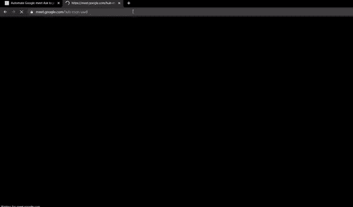

# 使用 JavaScript 自动化谷歌会议邀请加入页面

> 原文:[https://www . geesforgeks . org/automate-Google-meet-ask-join-page-use-JavaScript/](https://www.geeksforgeeks.org/automate-google-meet-ask-to-join-page-using-javascript/)

在本文中，我们将创建一个 Chrome 扩展，它将帮助我们在使用 JavaScript 的 Google meets 中自动执行请求加入屏幕。这个扩展帮助我们在谷歌会议中自动关闭音频和视频按钮，之后，它会自动点击邀请加入按钮。

#### 让我们**从项目开始:**

**第一步:**首先你需要为你的 Chrome 扩展创建一个 manifest.json 文件，让我们创建它。

```html
{
    "name": "automatic class joiner",
    "version": "1.0",
    "manifest_version": 2,
    "content_scripts": [{
        "matches": [""],
        "js": ["content.js"]
    }],
    "browser_action": {
        "default_popup": "popup.html",
        "default_title": "automatic class joiner"
    }
}
```

我们完成了我们的清单文件。每当一个新的网址打开时，清单文件将运行一个名为 content.js 的脚本

**步骤 2:** 现在让我们为 Chrome 扩展创建一个简单的前端。我们创建了一个名为 popup.html 的新的 HTML 文件。

## 超文本标记语言

```html
<!DOCTYPE html>
<html>

<head>
    <title>Online class joiner</title>
    <link rel="stylesheet" href="online.css"
        type="text/css" />
</head>

<body>
    <h2>Joiner Active</h2>

<p>
        You will automatically join the
        classes when this extension is ON.
    </p>

</body>

</html>
```

现在我们已经完成了前端部分，让我们构建扩展的主要功能，即 content.js 脚本文件。

**步骤 3:** 现在我们必须创建一个名为 content.js 的新文件

## java 描述语言

```html
function start() {
    url = location.href;
    if (url.includes("meet.google.com")) {
        its_meet();
    }
}

function its_meet() {
    items = document.getElementsByTagName('div');
    setTimeout(function() {
        try {
            for (i = 0; i < items.length; i++) {
                if (items[i].hasAttribute("aria-label")) {
                    if (items[i].getAttribute("aria-label")
                        .includes("microphone") ||
                        items[i].getAttribute("aria-label")
                        .includes("camera")) {
                        items[i].click();
                    }
                }
            }
        } catch (err) {
            console.log(err);
        }
    }, 5000)

    setTimeout(function() {
        for (i = 0; i < items.length; i++) {
            if (items[i].hasAttribute("jsname")) {
                if (items[i].getAttribute("jsname")
                    .includes("Qx7uuf")) {
                    items[i].click();
                }
            }
        }
    }, 8000);

}
start();
```

做了这么多工作后，我们的扩展就完成了。

**第四步:**我们试着运行一下。

首先你需要把它添加到谷歌 chrome 的扩展中，然后放松，让扩展来完成工作。

**输出:**



GitHub 回购请点击*https://github.com/Abhishek07Kalra/AutomaticClassJoiner*