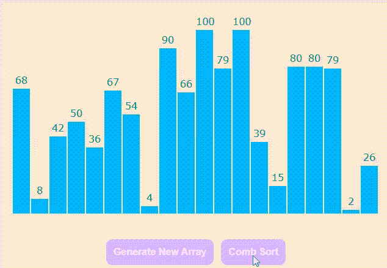

# 使用 JavaScript 的梳状排序可视化工具

> 原文:[https://www . geesforgeks . org/comb-sort-visualizer-use-JavaScript/](https://www.geeksforgeeks.org/comb-sort-visualizer-using-javascript/)

梳状排序主要是对[冒泡排序](https://www.geeksforgeeks.org/bubble-sort/)的改进。梳状排序通过使用大于 1 的间隙改进了冒泡排序。为了了解更多。请参考[梳子分类](https://www.geeksforgeeks.org/comb-sort/)。

像**梳状排序**这样的算法，通过可视化代替长代码就可以很容易理解。在本文中，**梳状排序可视化工具**是使用 **HTML、CSS** & **JavaScript** 实现的。

**先决条件:**

*   [梳状分类。](https://www.geeksforgeeks.org/comb-sort/)
*   基本的 HTML、CSS 和 JavaScript。
*   JavaScript [承诺](https://www.geeksforgeeks.org/javascript-promises/)。
*   JavaScript [异步/等待](https://www.geeksforgeeks.org/async-await-function-in-javascript/)功能。

**进场:**

*   按钮**生成新数组**使用**数学.随机()**函数生成一个随机值数组，以及一个对应于该值的高度条。
*   不同的颜色用于指示哪些元素未排序(天蓝色)、已比较(红色)和已排序(浅绿色)。
*   按钮**使用选择排序算法梳状排序**元素。
*   最后，对元素进行排序。

**示例:**点击“生成新数组”按钮，生成新的随机数组。单击“梳状排序”按钮执行可视化。

## 超文本标记语言

```html
<!DOCTYPE html>
<html lang="en">

  <!-- head -->
  <head>
    <meta charset="UTF-8" />
    <meta name="viewport" 
          content="width=device-width,
          initial-scale=1.0" />
    <meta http-equiv="X-UA-Compatible" 
          content="ie=edge" />

    <!-- title -->
    <title>Comb Sort Visualizer using JavaScript</title>

    <!-- linking style.css -->
    <link href="style.css" rel="stylesheet" />
  </head>
  <!-- body -->
  <body>
    <section class="head">Comb Sort</section>
    <section class="data-container"></section>
    <section id="ele"></section>
    <div style="margin: auto; width: fit-content">

      <!-- "Generate New Array" button -->
      <button class="btn1" onclick="generate()" id="Button1">
        Generate New Array
      </button>

      <!-- "Comb Sort" button -->
      <button class="btn2" onclick="CombSort(),disable()" 
      id="Button2">Comb Sort</button>
    </div>
  </body>

  <!-- linking script.js -->
  <script src="script.js"></script>
</html>
```

## style.css

```html
.mySlides {
  display: none;
}
body {
  background-color: rgb(255, 235, 211);
  font-family: Verdana, sans-serif;
}
.head {
  margin-top: 20px;
  margin-right: 20vw;
  margin-left: 20vw;
  text-align: center;
  font-size: 30px;
  background-color: #6f459e;
  color: white;
  border-radius: 19px;
  font-weight: bolder;
}
.data-container {
  width: 600px;
  height: 364px;
  position: relative;
  margin: 0 auto;
}
.bar {
  width: 28px;
  position: absolute;
  left: 0;
  bottom: 0;
  background-color: rgb(0, 183, 255);
  transition: 0.2s all ease;
}
.bar__id {
  position: absolute;
  top: -24px;
  width: 100%;
  text-align: center;
}
.btn1 {
  padding: 12px;
  font-weight: bolder;
  background-color: #6f459e;
  border-radius: 10px;
  color: white;
  font-size: 16px;
  border: white;
  margin-top: 1vw;
  margin-right: 1vw;
}
.btn2 {
  padding: 12px;
  font-weight: bolder;
  background-color: #6f459e;
  border-radius: 10px;
  color: white;
  font-size: 16px;
  border: white;
}
#ele {
  text-align: center;
  height: 35px;
}
```

## script.js

```html
const container = document.querySelector(".data-container");

// Function to generate bars
function generatebars(num = 20) {

  // For loop to generate 20 bars
  for (let i = 0; i < num; i += 1) {

    // To generate random values from 1 to 100
    const value = Math.floor(Math.random() * 100) + 1;

    // To create element "div"
    const bar = document.createElement("div");

    // To add class "bar" to "div"
    bar.classList.add("bar");

    // Provide height to the bar
    bar.style.height = `${value * 3}px`;

    // Translate the bar towards positive X axis
    bar.style.transform = `translateX(${i * 30}px)`;

    // To create element "label"
    const barLabel = document.createElement("label");

    // To add class "bar_id" to "label"
    barLabel.classList.add("bar__id");

    // Assign value to "label"
    barLabel.innerHTML = value;

    // Append "Label" to "div"
    bar.appendChild(barLabel);

    // Append "div" to "data-container div"
    container.appendChild(bar);
  }
}

// Function calculate_gap
function calculate_gap(gap) {

  gap = parseInt((gap * 10) / 13, 10);
  if (gap < 1) return 1;
  return gap;
}

// Asynchronous function to perform "Comb Sort"
async function CombSort(delay = 600) {
  let bars = document.querySelectorAll(".bar");

  var gap = 20;

  let swapped = true;

  while (gap != 1 || swapped == true) {

    // Calling calculate_gap function
    gap = calculate_gap(gap);

    // Initializing swapped with false
    swapped = false;

    for (var i = 0; i < 20 - gap; i++) {

      // Assigning value of ith bar into value1
      var value1 = parseInt(bars[i].childNodes[0].innerHTML);

      // Assigning value of i+gapth bar into value2
      var value2 = parseInt(bars[i + gap].childNodes[0].innerHTML);
      if (value1 > value2) {

        // Provide red color to the ith bar
        bars[i].style.backgroundColor = "red";

        // Provide red color to the i+gapth bar
        bars[i + gap].style.backgroundColor = "red";

        // Swap ith bar with (i+gap)th bar
        var temp1 = bars[i].style.height;
        var temp2 = bars[i].childNodes[0].innerText;

        // To pause the execution of code for 300 milliseconds
        await new Promise((resolve) =>
          setTimeout(() => {
            resolve();
          }, 300)
        );

        // Swap ith bar with (i+gap)th bar
        bars[i].style.height = bars[i + gap].style.height;
        bars[i].childNodes[0].innerText = bars[i + gap].childNodes[0].innerText;
        bars[i + gap].style.height = temp1;
        bars[i + gap].childNodes[0].innerText = temp2;

        // Set swapped
        swapped = true;

        // To pause the execution of code for 300 milliseconds
        await new Promise((resolve) =>
          setTimeout(() => {
            resolve();
          }, 300)
        );
      }
      // Provide skyblue color to the ith bar
      bars[i].style.backgroundColor = "rgb(0, 183, 255)";

      // Provide skyblue color to the i+gapth bar
      bars[i + gap].style.backgroundColor = "rgb(0, 183, 255)";

      // To pause the execution of code for 300 milliseconds
      await new Promise((resolve) =>
        setTimeout(() => {
          resolve();
        }, 300)
      );
    }
  }
  for (var x = 0; x < 20; x++) {
    bars[x].style.backgroundColor = "rgb(49, 226, 13)";
  }

  // To enable the button "Generate New Array" after final(sorted)
  document.getElementById("Button1").disabled = false;
  document.getElementById("Button1").style.backgroundColor = "#6f459e";

  // To enable the button "Comb Sort" after final(sorted)
  document.getElementById("Button2").disabled = false;
  document.getElementById("Button2").style.backgroundColor = "#6f459e";
}

// Call "generatebars()" function
generatebars();

// Function to generate new random array
function generate() {
  window.location.reload();
}

// Function to disable the button
function disable() {

  // To disable the button "Generate New Array"
  document.getElementById("Button1").disabled = true;
  document.getElementById("Button1").style.backgroundColor = "#d8b6ff";

  // To disable the button "Comb Sort"
  document.getElementById("Button2").disabled = true;
  document.getElementById("Button2").style.backgroundColor = "#d8b6ff";
}
```

**输出**

