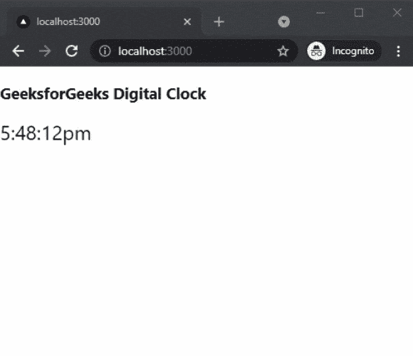

# 如何在 Next.js 中添加数字钟？

> 原文:[https://www . geesforgeks . org/如何添加下一个数字时钟 js/](https://www.geeksforgeeks.org/how-to-add-a-digital-clock-in-next-js/)

在本文中，我们将学习如何在 NextJs 中添加时钟。NextJS 是一个基于 React 的框架。它有能力为不同的平台开发漂亮的网络应用程序，如视窗、Linux 和 mac。动态路径的链接有助于有条件地呈现您的 NextJS 组件。

**方法:**要添加我们的时钟，我们将使用实时时钟包。react-live-clock 包帮助我们在应用程序的任何地方添加时钟。首先，我们将安装 react-live-clock 软件包，然后我们将在主页上添加一个时钟。

**创建 NextJS 应用程序:**您可以使用以下命令创建一个新的 NextJs 项目:

```
npx create-next-app gfg
```

**安装所需的包:**现在我们将使用以下命令安装 react-live-clock 包:

```
npm i react-live-clock
```

**项目结构:**会是这样的。


**添加时钟:**我们可以在安装了 react-live-clock 包后，在我们的应用中轻松添加时钟。对于这个例子，我们将把时钟添加到我们的主页。

在 **index.js** 文件中添加以下内容:

## java 描述语言

```
import React from "react";
import Clock from 'react-live-clock';

export default function MyQuotesSlider() {
  return (
    <div>
      <h3>GeeksforGeeks Digital Clock</h3>
      <Clock
          format={'h:mm:ssa'}
          style={{fontSize: '1.5em'}}
          ticking={true} />
    </div>
  );
}
```

**说明:**首先在上例中，我们是从已安装的包中导入 Clock 组件。之后，我们将在时钟组件中添加格式、样式和其他参数。

**运行应用的步骤:**在终端运行下面的命令运行应用。

```
npm run dev
```

### 输出:

